# Blue Bracket

## For machine vision & ai on raspberry pi and jetson nano on the edge.

Machine vision on the edge requires a motherboard, a camera, and a few other peripherals. Environmental sensors, a UPS to provide power, and screens and other display units to communicate w/ the user, are also great to have.

[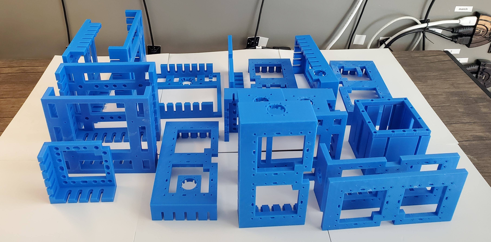](brackets)

Here are [nine designs](designs) for this purpose. Each yields a modern Linux machine that is connected to a camera and can run almost anything Python, TensorFlow, OpenCV, and much more. The motherboard is either a Raspberry Pi or a Jetson Nano. The rest of the hardware is picked accordingly. Click on the images to see more.

| [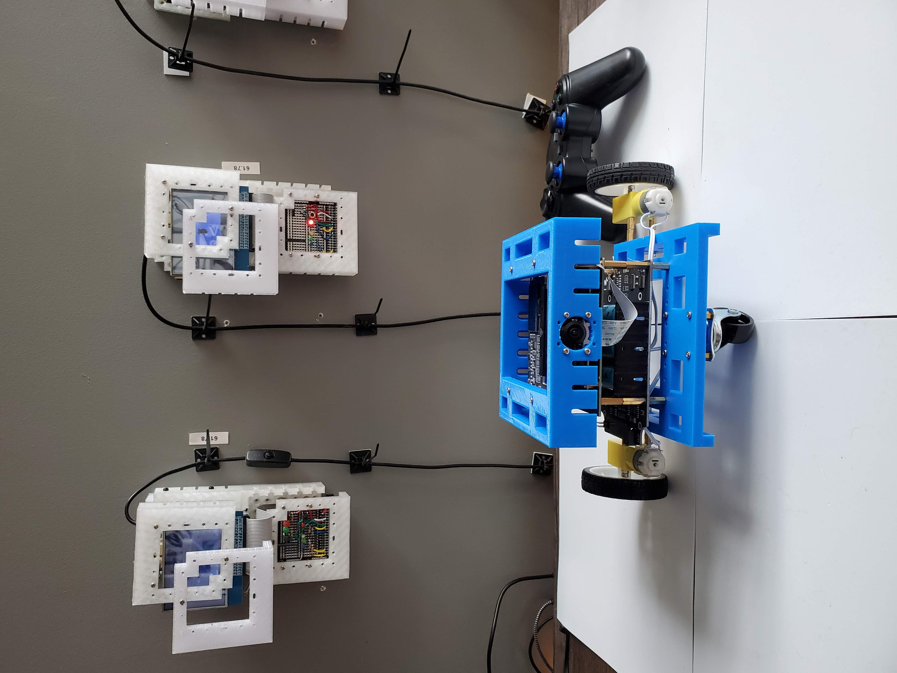](designs/blue-jetbot.md) | [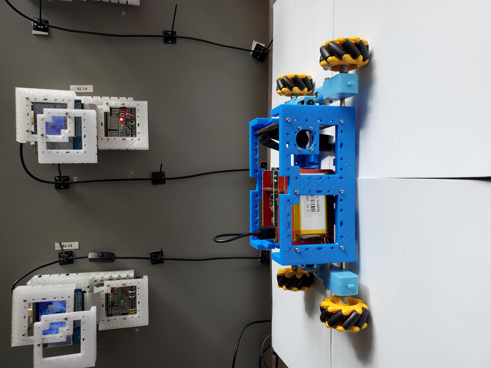](designs/blue-buggy.md) | [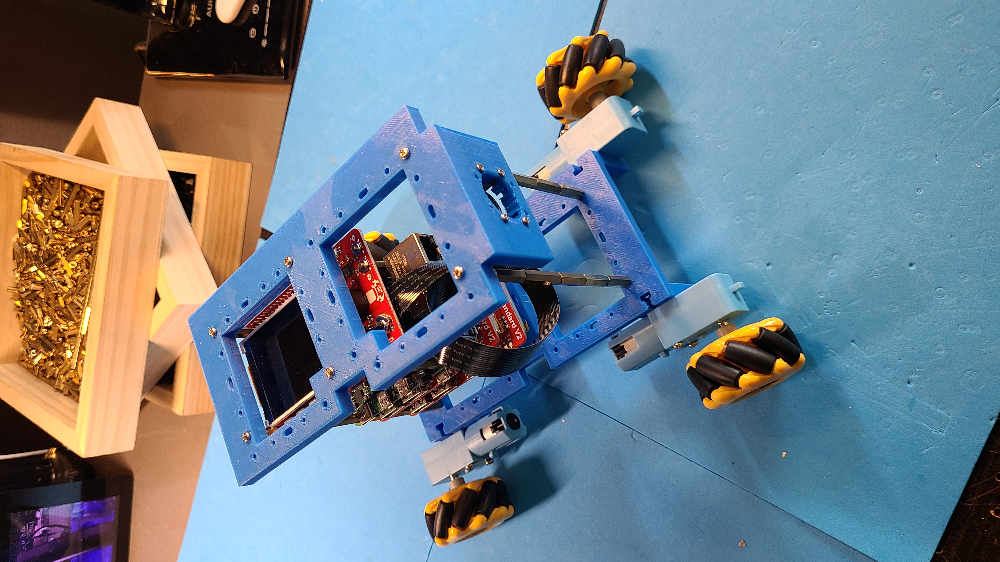](designs/blue-buggy-2.md) |
| --- | --- | --- |
| [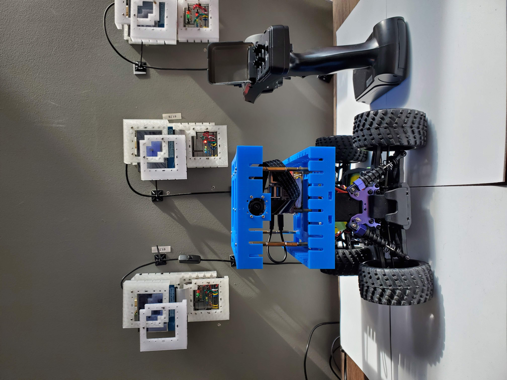](designs/blue-donkey.md) | [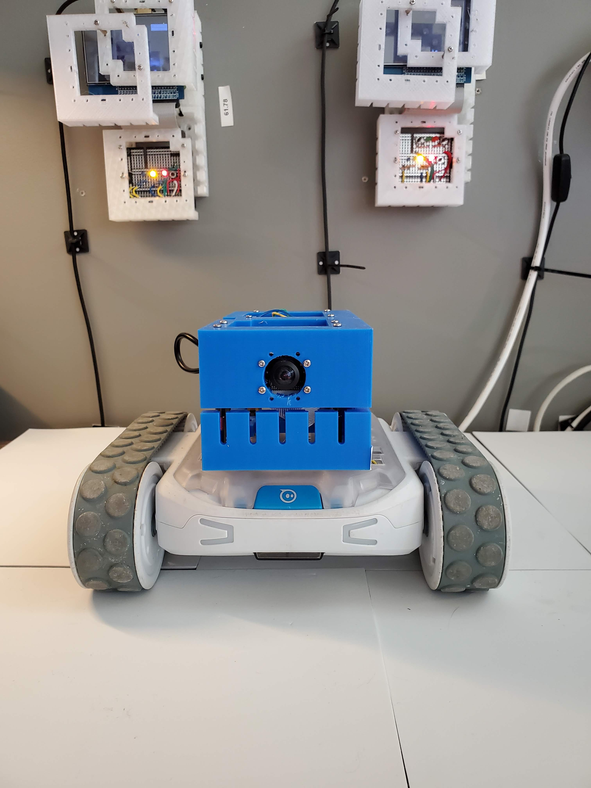](designs/blue1.md) | [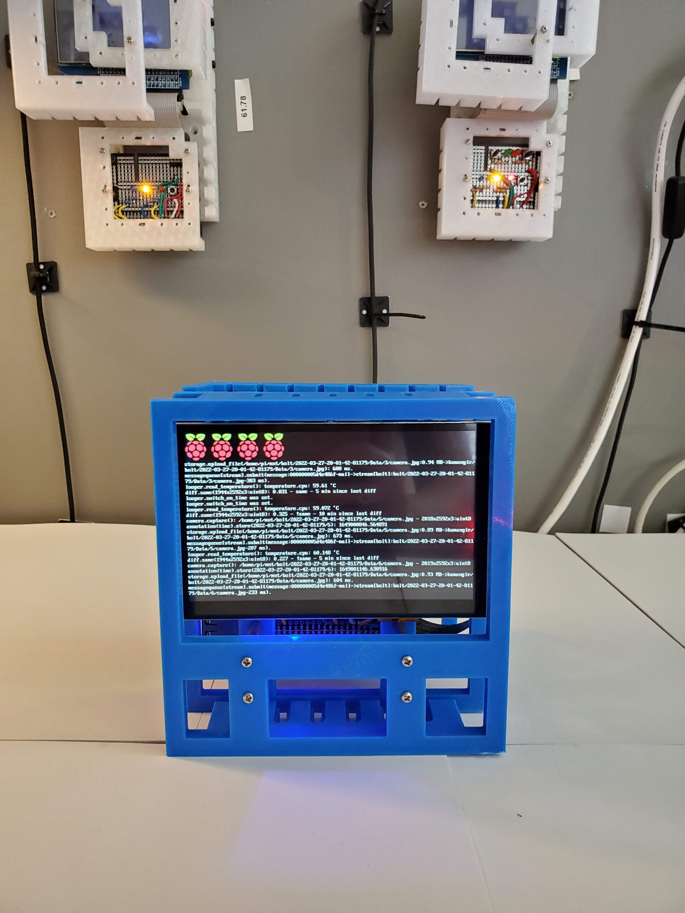](designs/blue3.md) |
| [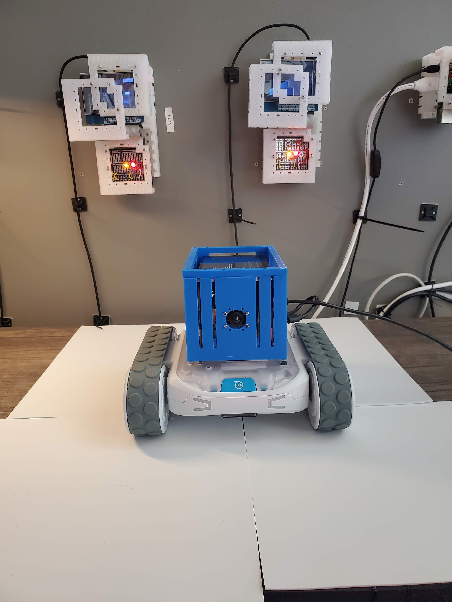](designs/blue4.md) | [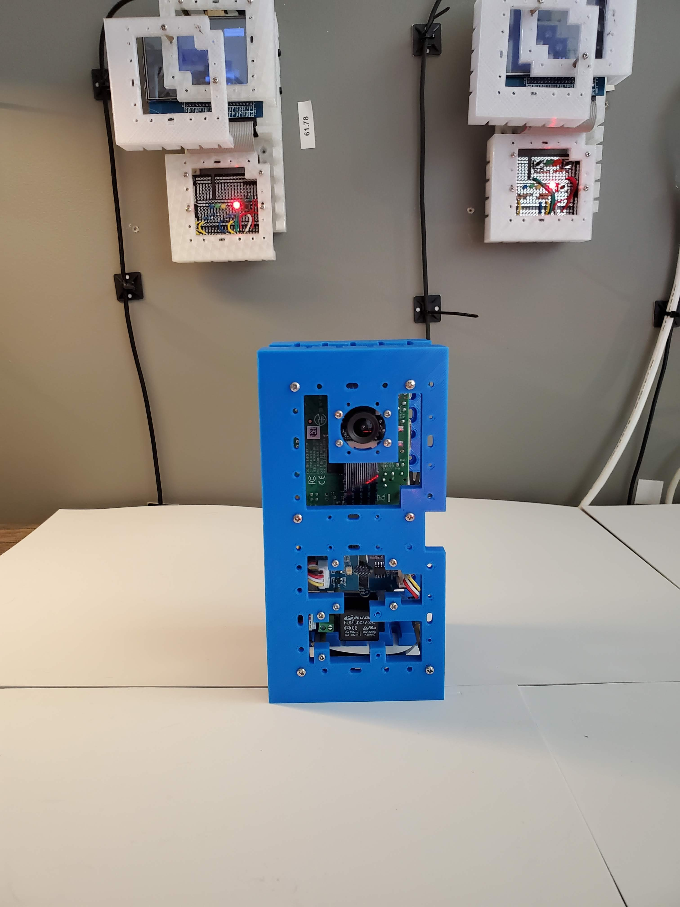](designs/chenar-grove.md) | [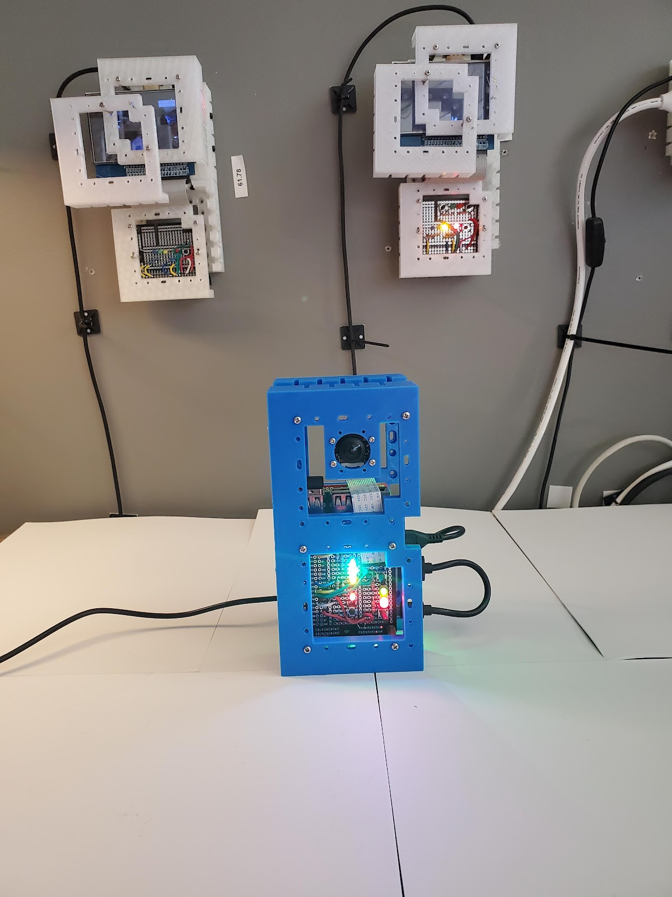](designs/cube.md) |
| [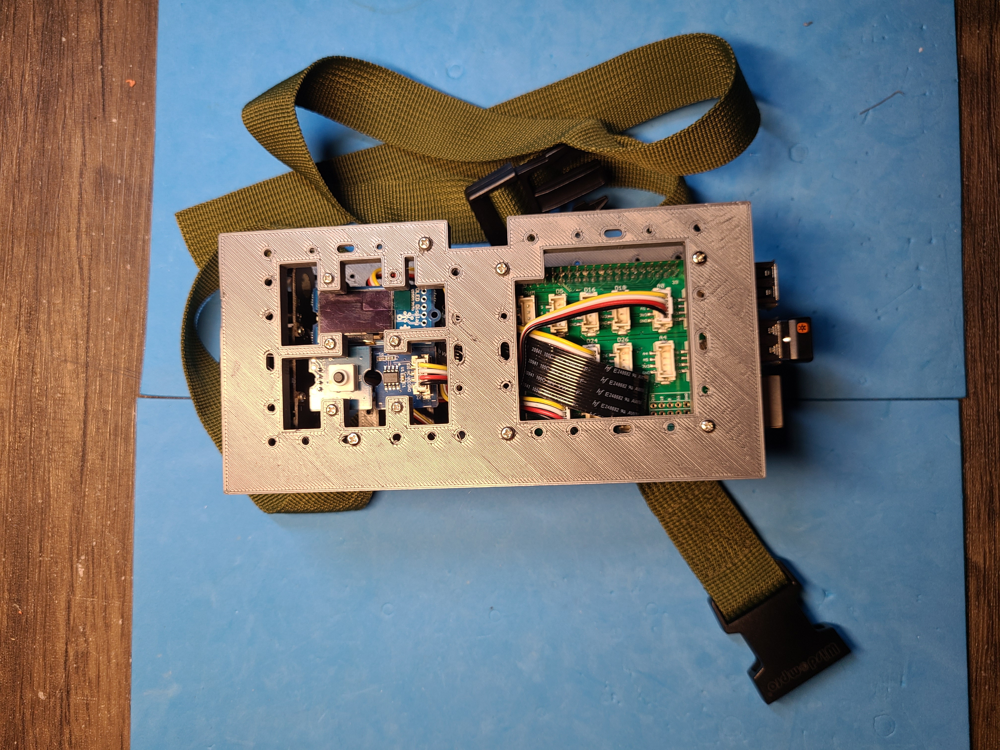](designs/dec82.md) | [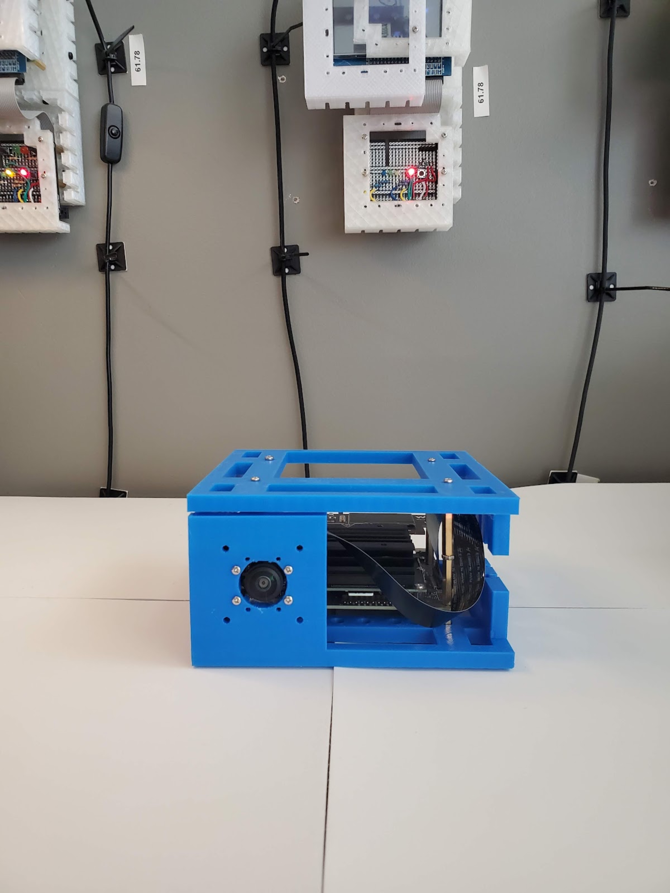](designs/eye_nano.md) | [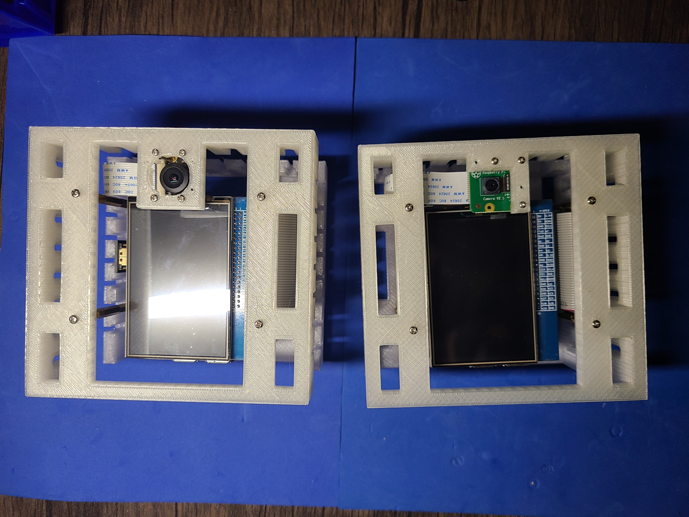](designs/portal.md) |

For each design a bom is provided.

Each design uses two or more variants of the `blue bracket`. `stl`/`obj`/`skp` (SketchUp 2022) files for the brackets plus gcode for PLA in low quality (0.3 mm) for [DigiLab 3D Printer 3D45](https://3pitech.com/products/dremel-digilab-3d45-3d-printer) are [included in this repo](brackets).

---
built by [`abcli-7.2164.1-main`](https://github.com/kamangir/awesome-bash-cli) - 19 November 2022, 20:32:26.

