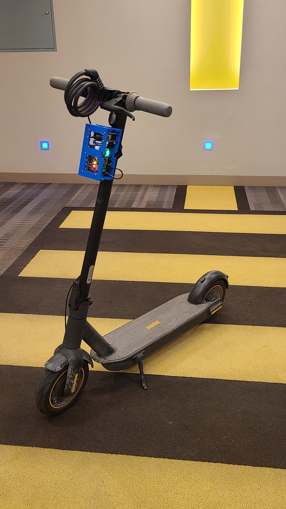

# Blue Bracket

## For machine vision & ai on raspberry pi and jetson nano on the edge.

Machine vision on the edge requires a motherboard, a camera, and a few other peripherals. Environmental sensors, a UPS to provide power, and screens and other display units to communicate w/ the user, are also great to have.

---

If you are an individual or a group involved in AI on the edge and are interested in obtaining one of these designs, please reach out to me by sending an email to [arash@kamangir.net](mailto:arash@kamangir.net?subject=blue%20brackets) along with your GitHub handle. As a reciprocal gesture, I kindly request that you release your code under a permissive license, preferably Creative Commons. Please note that this offer is applicable only within 🇨🇦 due to legal considerations.

---

Here are [multiple designs](designs) for this purpose. Each yields a modern Linux machine that is connected to a camera and can run almost anything Python, TensorFlow, OpenCV, and much more. The motherboard is either a Raspberry Pi or a Jetson Nano. The rest of the hardware is picked accordingly. Click on the images to see more.

|  |  |  |  |  |
| --- | --- | --- | --- | --- |
|  |  |  |  |  |
|  |  |  |  |  |
|  |  |  |  |  |
|  |  |  |  |  |
|  |  |  |  |  |

For each design a bom is provided. 

Each design uses two or more variants of the `blue bracket`. `stl`/`obj`/`skp` (SketchUp 2022) files for the brackets plus gcode for PLA in low quality (0.3 mm) for [DigiLab 3D Printer 3D45](https://3pitech.com/products/dremel-digilab-3d45-3d-printer) are [included in this repo](brackets).

To boot and terraform the designs use this <a href="https://github.com/kamangir/blue-sbc">python + bash bootstrap</a>.

---
built by [`abcli-7.2307.1-2023-06-aws-batch-a`](https://github.com/kamangir/awesome-bash-cli), based on bracket-1.243.1.
