# gen3

1. `c`: `compact` - `14 mm` shorter.
1. `t`: `tall` - `14 mm` taller.
1. `w`: `wide` - `14 mm` wider.

## cr

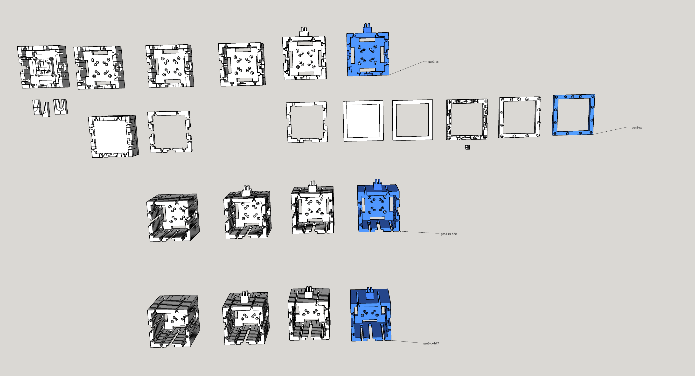

## g

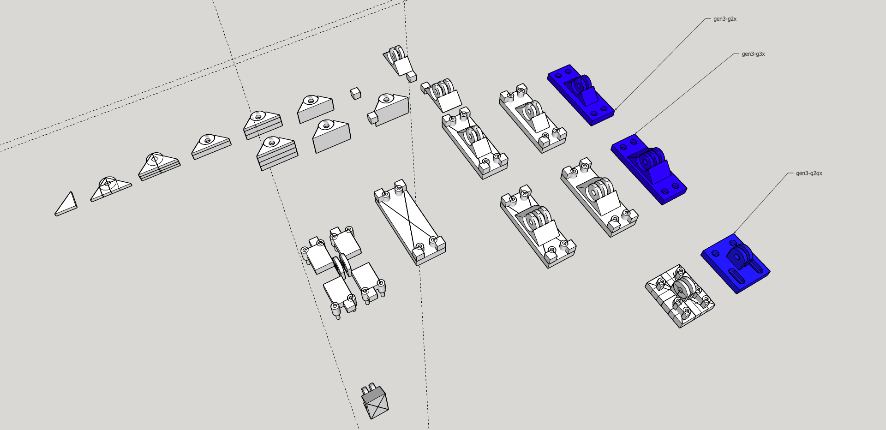

## scx

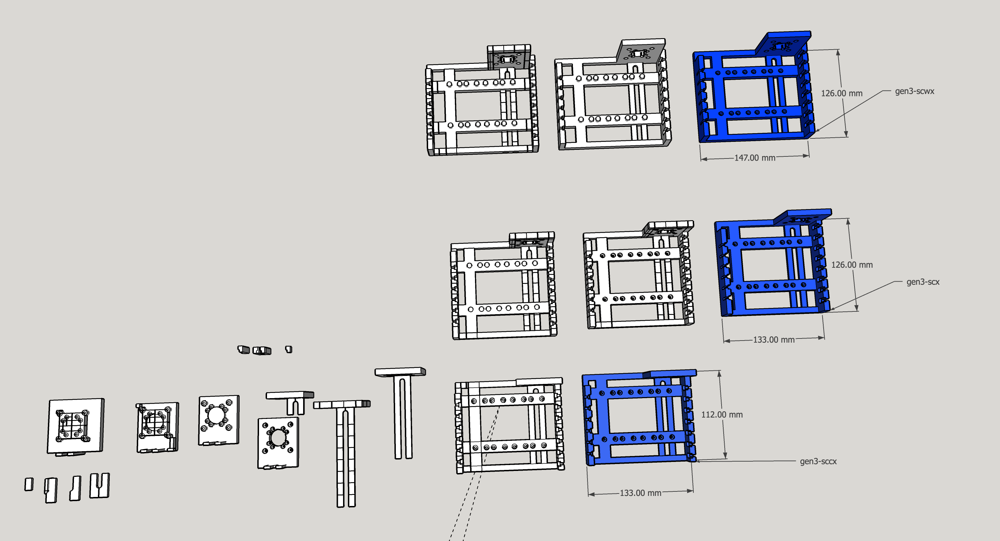

## sdx

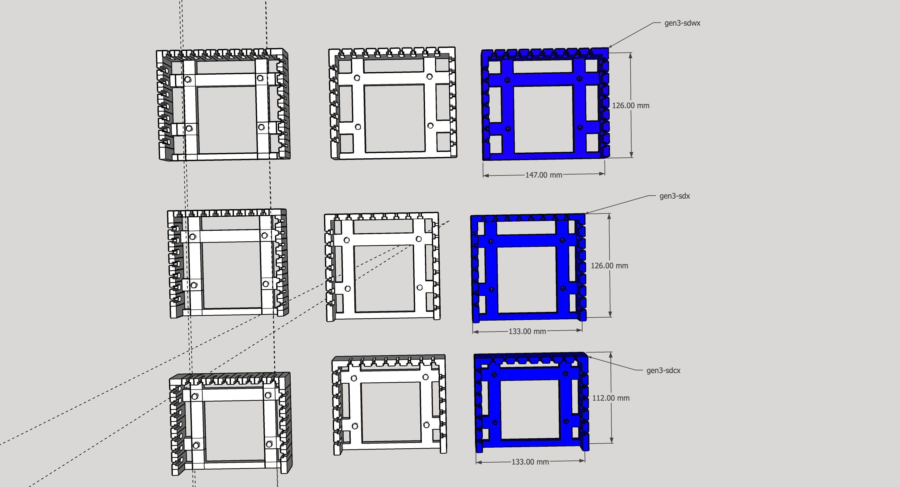

## sfx

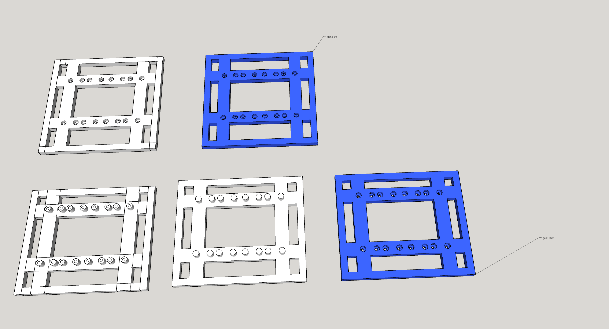

## sgx

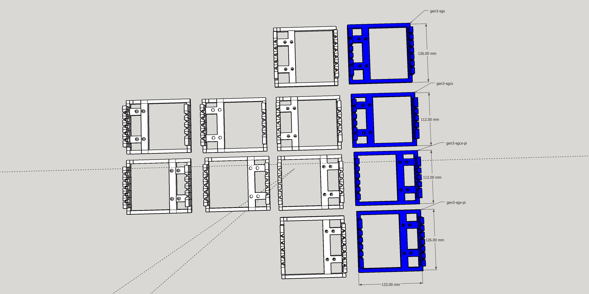

## shix

Obsolete -> [gen3-skx](#skx)

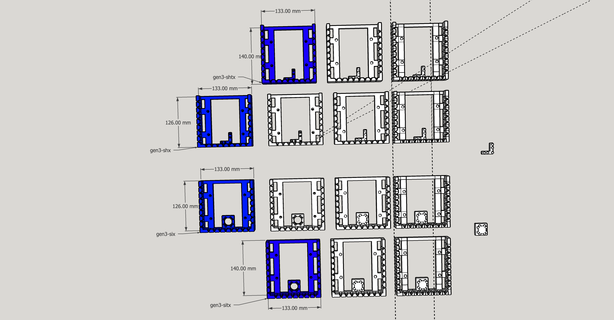

## sjx

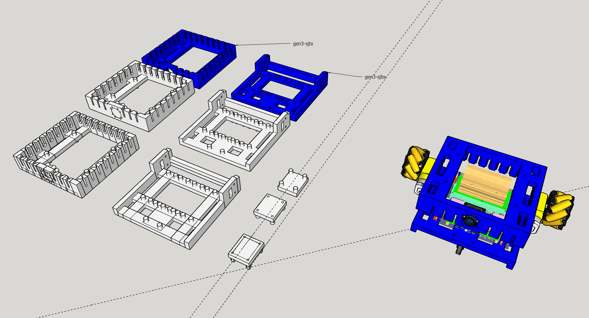

## skx

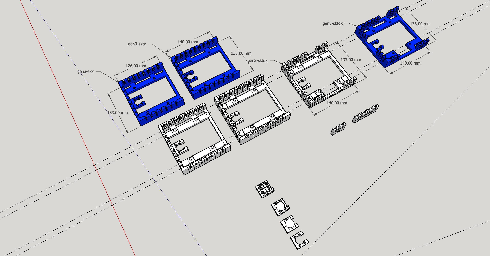

## ssx

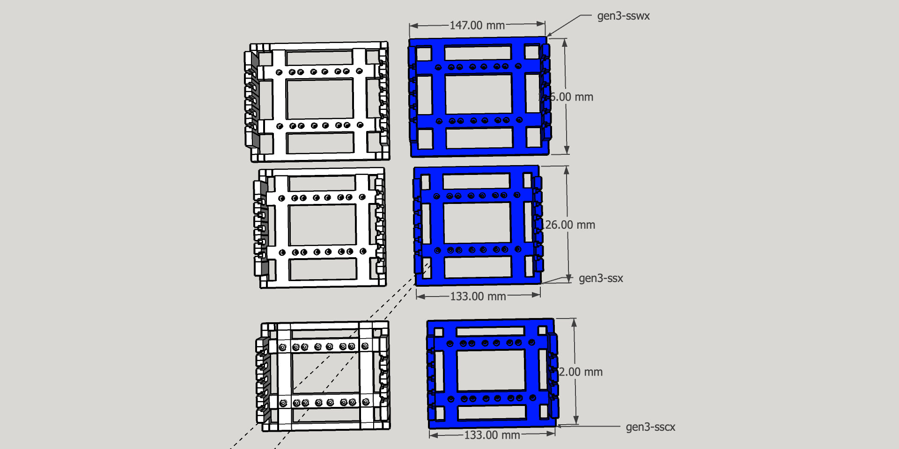

## stx

## sux

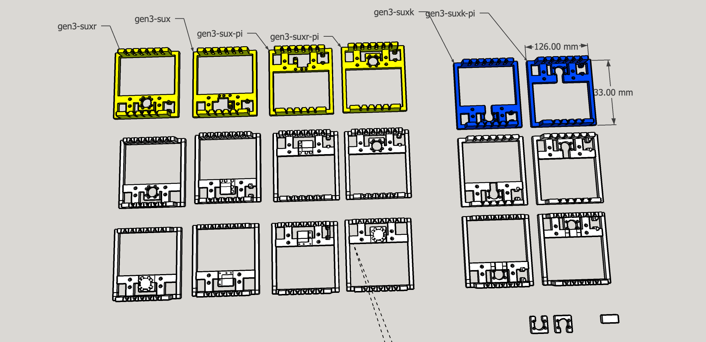

## sx

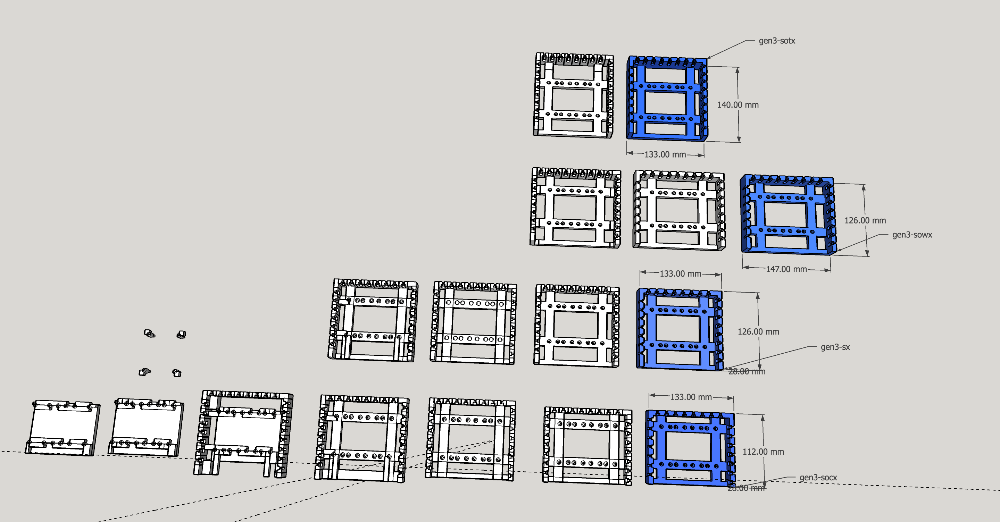
