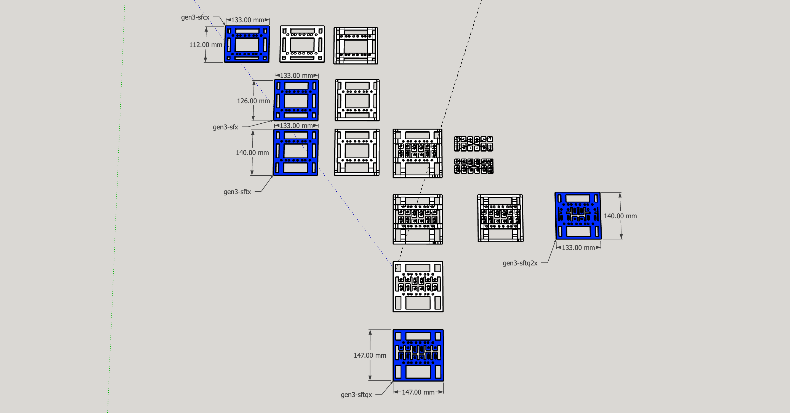
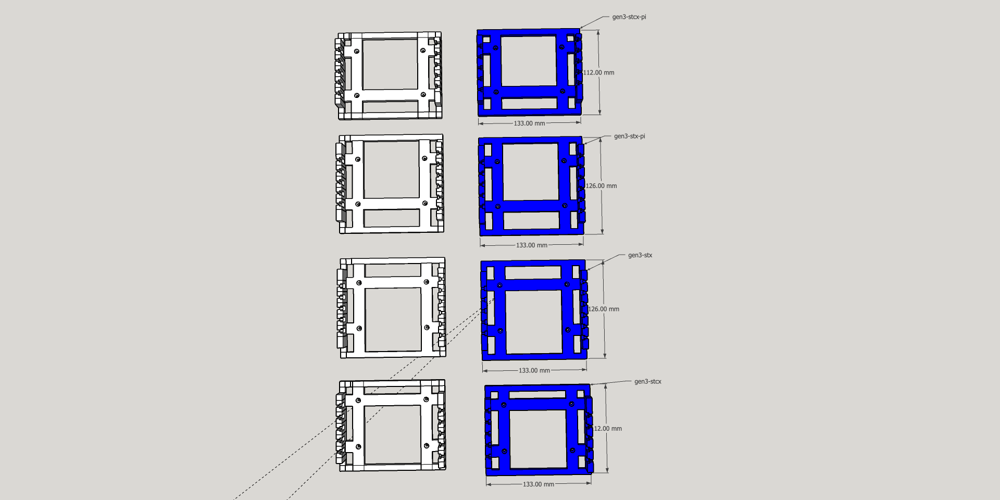

# gen3

1. `c`: `compact` - `14 mm` shorter.
1. `t`: `tall` - `14 mm` taller.
1. `w`: `wide` - `14 mm` wider.

## cr

## g

## scx

## sdx

## sfx

## sgx

## shix

Obsolete -> [gen3-skx](#skx)

## sjx

## skx

## ssx

## stx

## sux

## sx

