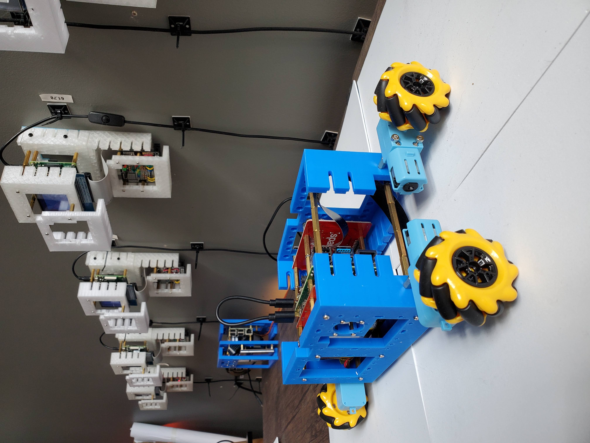
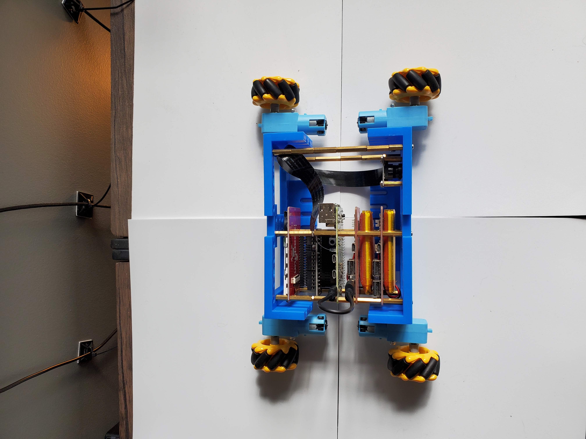
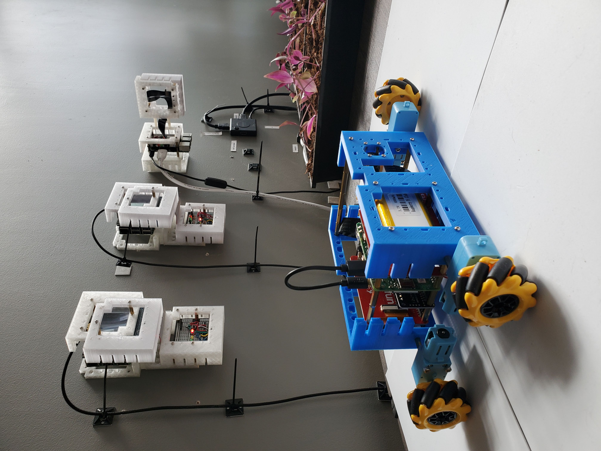

A Raspberry Pi robot based on <a href="https://projects.raspberrypi.org/en/projects/build-a-buggy/0">build-a-buggy</a> that uses <a href="https://gpiozero.readthedocs.io/en/stable/index.html">gpiozero</a> - also see <a href="https://www.waveshare.com/wiki/BuildMecar-Kit">BuildMecar-Kit</a>.

|  |  |  |
| --- | --- | --- |

---

# [bom](../parts.md)

1. [48mm Mecanum Wheel Pair](../parts.md#48mm-mecanum-wheel-pair)
1. [Adafruit DC and Stepper Motor Bonnet for Raspberry Pi](../parts.md#adafruit-dc-and-stepper-motor-bonnet-for-raspberry-pi)
1. [DC Gearbox Motor - TT Motor](../parts.md#dc-gearbox-motor---tt-motor)
1. [DFRobot GPS USB](../parts.md#dfrobot-gps-usb)
1. [MakerFocus Raspberry Pi UPS Hat](../parts.md#makerfocus-raspberry-pi-ups-hat)
1. [Raspberry Pi Camera](../parts.md#raspberry-pi-camera)
1. [Raspberry Pi](../parts.md#raspberry-pi)
1. [SparkFun Top pHAT for Raspberry Pi](../parts.md#sparkfun-top-phat-for-raspberry-pi)

# [brackets](../brackets)

1. [gen1-dw-b](../brackets/gen1-dw-b/gen1-dw-b.stl)
1. [gen1-dw-t](../brackets/gen1-dw-t/gen1-dw-t.stl)

