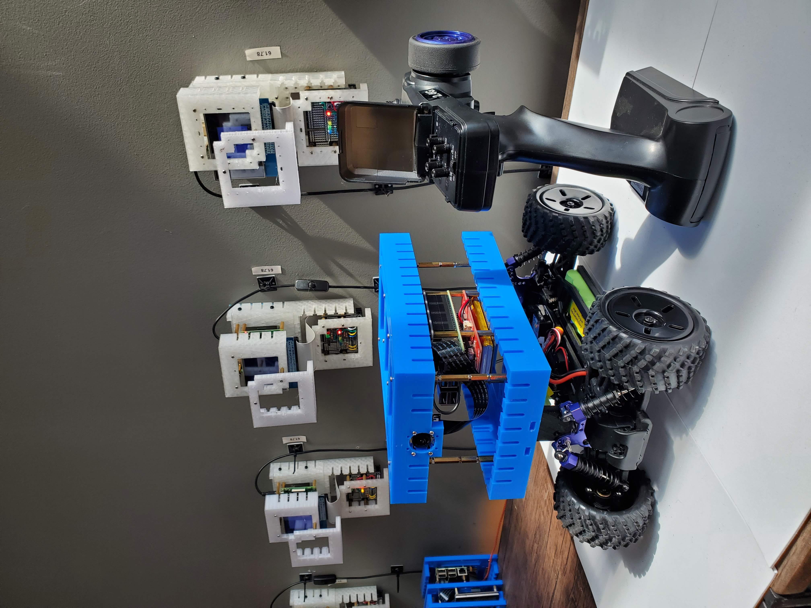
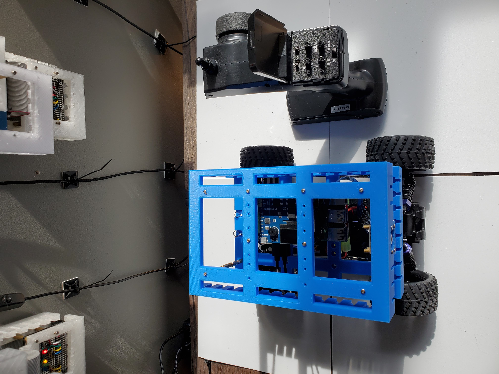
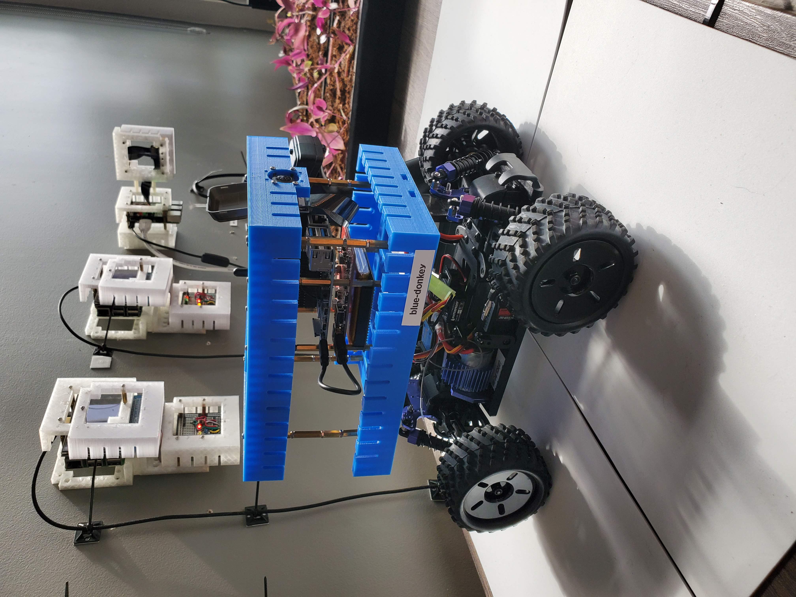

A <a href="https://docs.donkeycar.com/">Donkey Car</a> + cloud pieces from <a href="blue1.md">blue1</a> that supports both Raspberry Pi and Jetson Nano motherboards.

|  |  |  |
| --- | --- | --- |

---

# [bom](../parts.md)

1. [Adafruit DC and Stepper Motor Bonnet for Raspberry Pi](../parts.md#adafruit-dc-and-stepper-motor-bonnet-for-raspberry-pi)
1. [Adafruit TB6612 1.2A DC Stepper Motor Driver Breakout Board](../parts.md#adafruit-tb6612-12a-dc-stepper-motor-driver-breakout-board)
1. [DFRobot GPS USB](../parts.md#dfrobot-gps-usb)
1. [DFRobot Jetson Nano UPS Hat](../parts.md#dfrobot-jetson-nano-ups-hat)
1. [Exceed Fire Blue RC Buggy 1/16 2.4Ghz](../parts.md#exceed-fire-blue-rc-buggy-1/16-24ghz)
1. [Jetson Nano Wideangle Camera](../parts.md#jetson-nano-wideangle-camera)
1. [Jetson Nano](../parts.md#jetson-nano)
1. [MakerFocus Raspberry Pi UPS Hat](../parts.md#makerfocus-raspberry-pi-ups-hat)
1. [Raspberry Pi Camera](../parts.md#raspberry-pi-camera)
1. [Raspberry Pi](../parts.md#raspberry-pi)
1. [SparkFun Top pHAT for Raspberry Pi](../parts.md#sparkfun-top-phat-for-raspberry-pi)
1. [Waveshare 1.3" OLED Display for Jetson Nano](../parts.md#waveshare-13-oled-display-for-jetson-nano)

# [brackets](../brackets)

1. [gendk-b](../brackets/gendk-b/gendk-b.stl)
1. [gendk-t](../brackets/gendk-t/gendk-t.stl)

