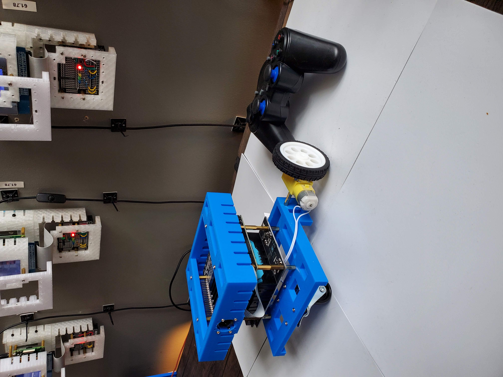
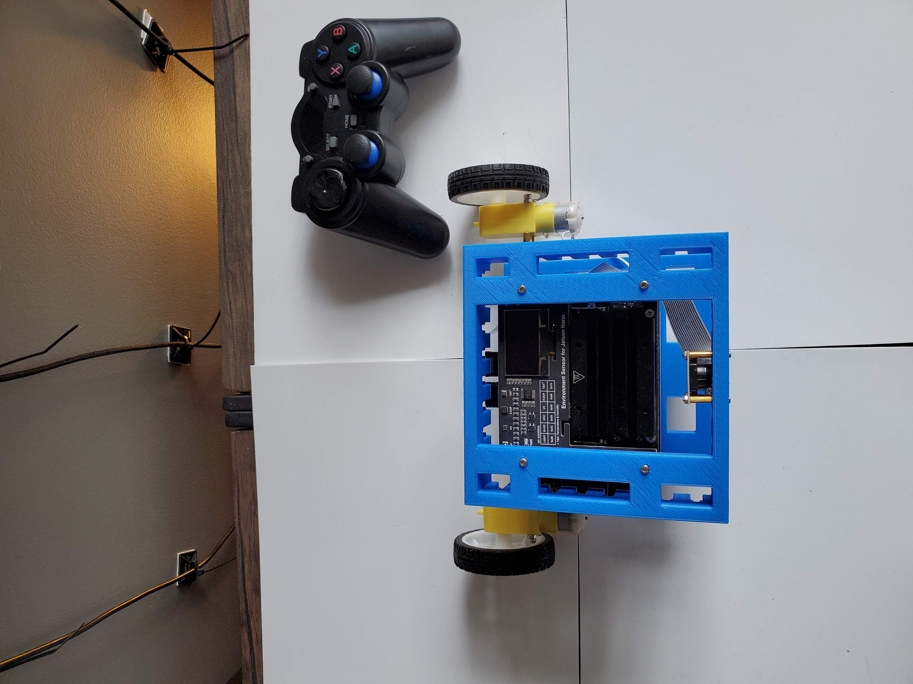
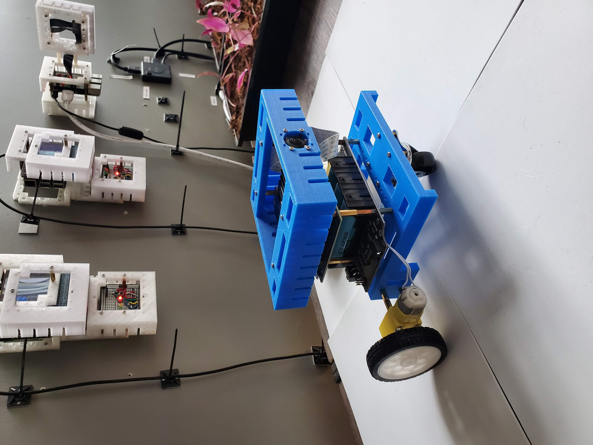

An <a href="https://jetbot.org/master/index.html">Nvidia Jetbot</a> compatible design using <a href="https://www.waveshare.com/jetbot-ai-kit-acce.htm">Waveshare AI Kit Accessories</a>.

|  |  |  |  |
| --- | --- | --- | --- |

---

# [bom](../parts.md)

1. [65mm White Wheel for TT DC Gearbox Motors](../parts.md#65mm-white-wheel-for-tt-dc-gearbox-motors)
1. [DC Gearbox Motor - TT Motor](../parts.md#dc-gearbox-motor-tt-motor)
1. [JetBot AI Kit Accessories](../parts.md#jetbot-ai-kit-accessories)
1. [Jetson Nano Wideangle Camera](../parts.md#jetson-nano-wideangle-camera)
1. [Jetson Nano](../parts.md#jetson-nano)
1. [Waveshare 1.3" OLED Display for Jetson Nano](../parts.md#waveshare-13-oled-display-for-jetson-nano)

# [brackets](../brackets)

1. [gen3-sjbx](../brackets/gen3-sjbx/gen3-sjbx.stl)
1. [gen3-sjtx](../brackets/gen3-sjtx/gen3-sjtx.stl)

