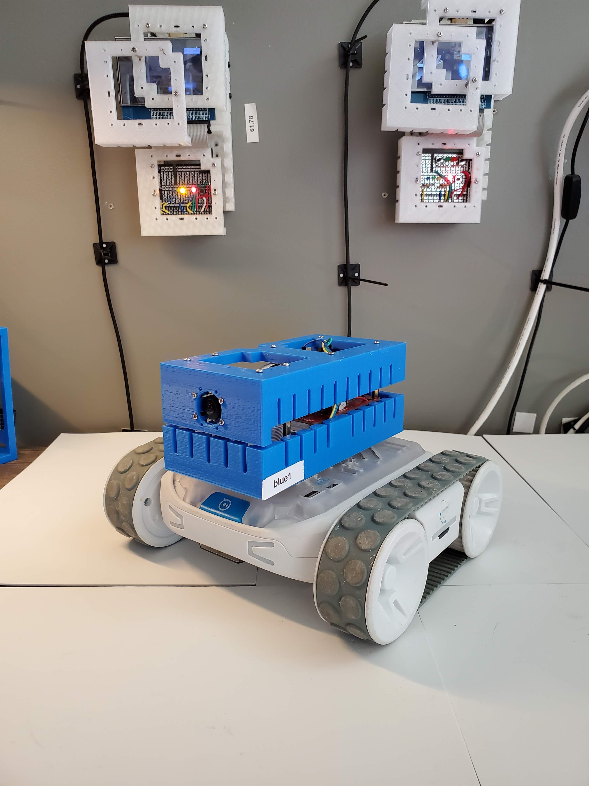
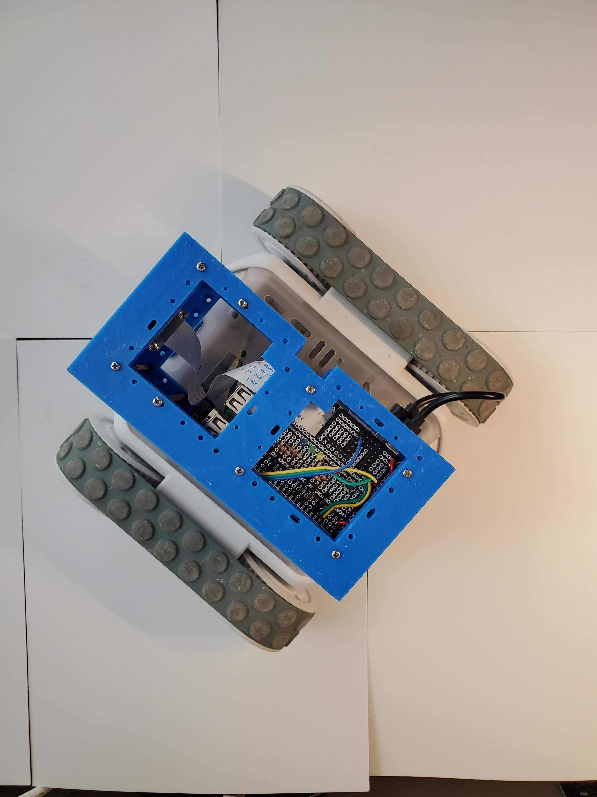
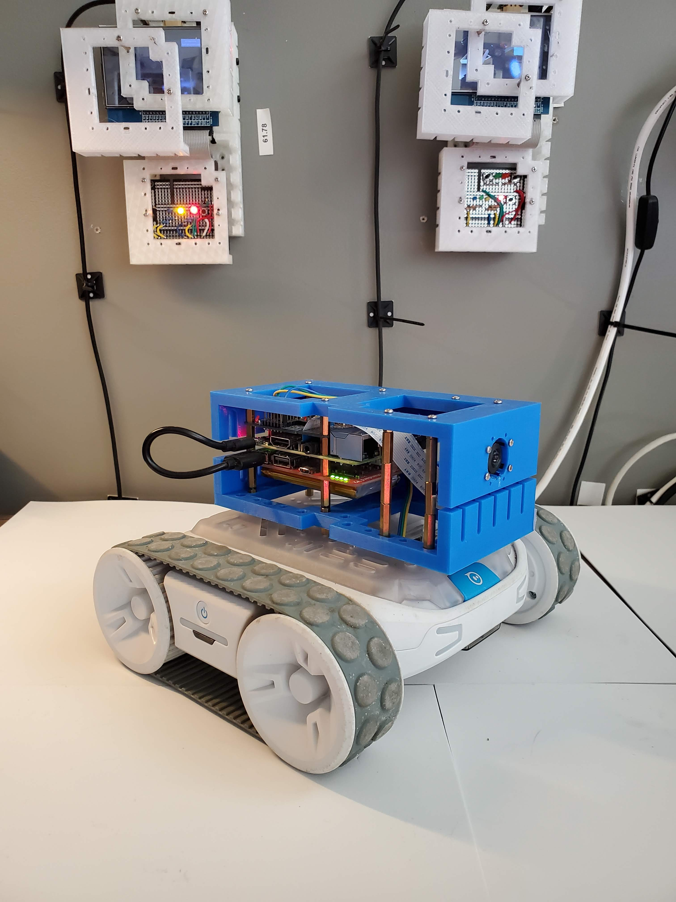

Download <a href="https://github.com/kamangir/blue-rvr">python+bash code</a> and read more: <a href="https://arash-kamangir.medium.com/camera-code-action-9e6f8c50a272">camera, code, action</a>.

|  |  |  |  |
| --- | --- | --- | --- |

---

# [bom](../parts.md)

1. [DFRobot GPS USB](../parts.md#dfrobot-gps-usb)
1. [MakerFocus Raspberry Pi UPS Hat](../parts.md#makerfocus-raspberry-pi-ups-hat)
1. [Raspberry Pi Camera](../parts.md#raspberry-pi-camera)
1. [Raspberry Pi](../parts.md#raspberry-pi)
1. [Sphero RVR](../parts.md#sphero-rvr)

# [brackets](../brackets)

1. [gen1-d](../brackets/gen1-d/gen1-d.stl)
1. [gen1-dm](../brackets/gen1-dm/gen1-dm.stl)

