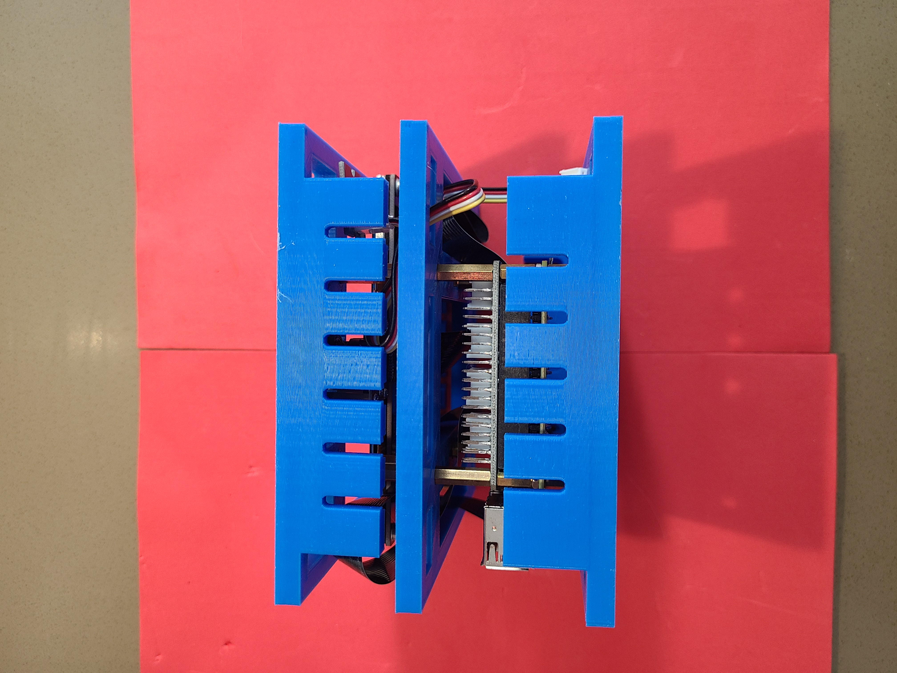

Python + bash <a href="https://github.com/kamangir/blue-sbc">bootstrap</a> for edge computing on single board computers.

|  |  |  |  |  |
| --- | --- | --- | --- | --- |
|  |  |  |  |  |

---

# [bom](../parts.md)

1. [DFRobot 5" Display](../parts.md#dfrobot-5-display)
1. [Grove Button](../parts.md#grove-button)
1. [Grove Raspberry Pi Hat](../parts.md#grove-raspberry-pi-hat)
1. [MakerFocus Raspberry Pi UPS Hat](../parts.md#makerfocus-raspberry-pi-ups-hat)
1. [Raspberry Pi Camera](../parts.md#raspberry-pi-camera)
1. [Raspberry Pi](../parts.md#raspberry-pi)

# [brackets](../brackets)

1. [gen3-sfx](../brackets/gen3-sfx/gen3-sfx.stl)
1. [gen3-ssx](../brackets/gen3-ssx/gen3-ssx.stl)
1. [gen3-suxk-pi](../brackets/gen3-suxk-pi/gen3-suxk-pi.stl)

