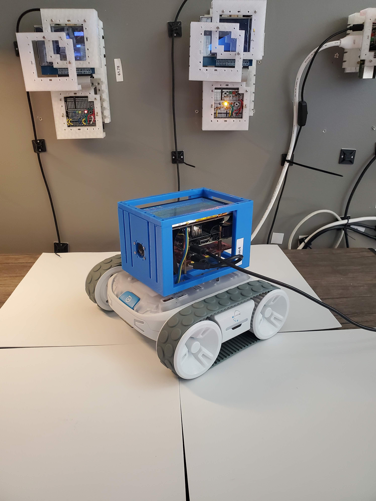
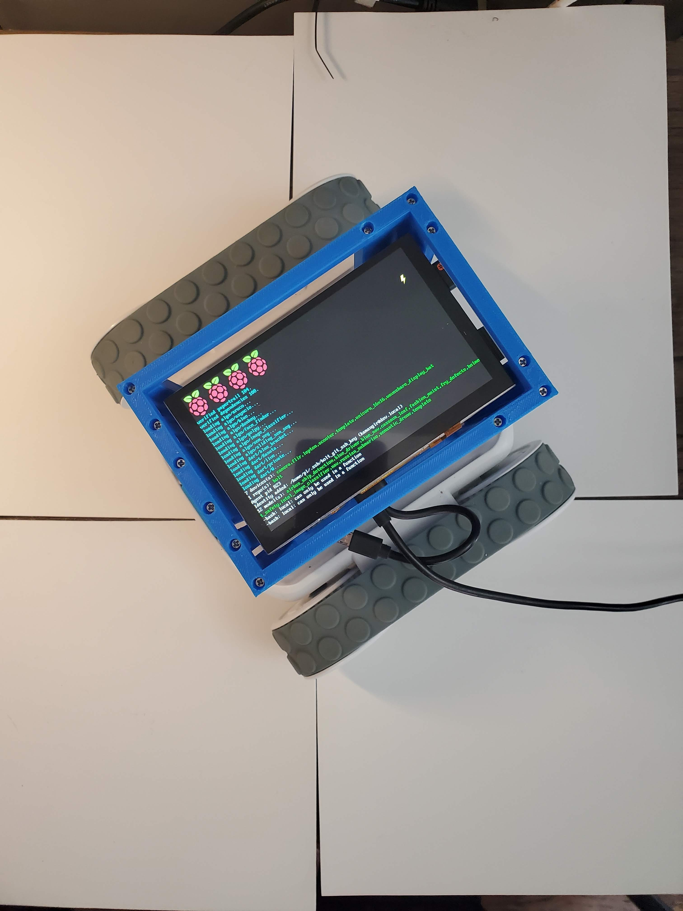
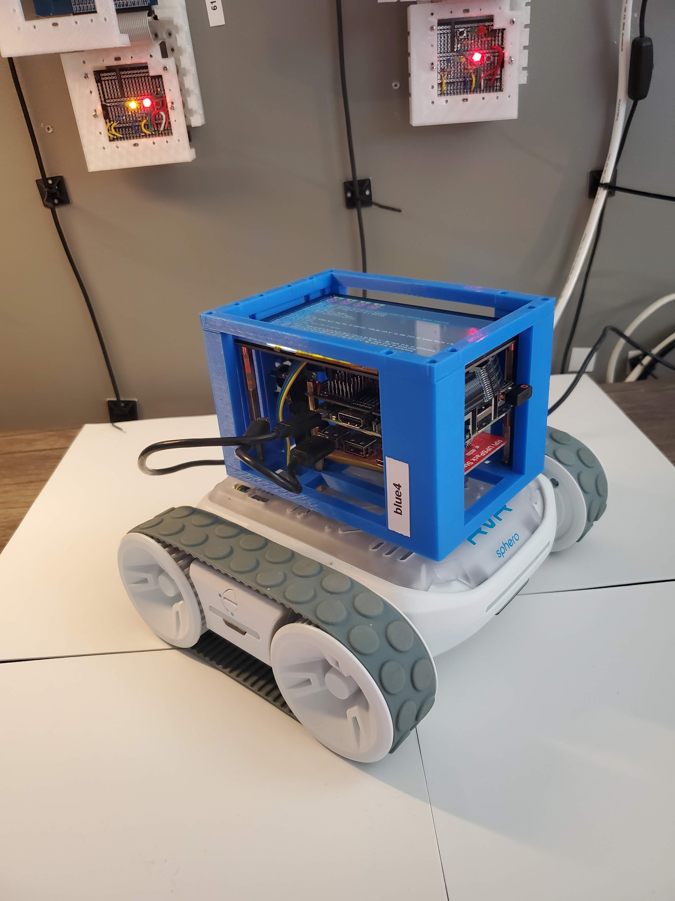

Python + bash <a href="https://github.com/kamangir/blue-sbc">bootstrap</a> for edge computing on single board computers.

|  |  |  |  |
| --- | --- | --- | --- |

---

# [bom](../parts.md)

1. [DFRobot 5" Display](../parts.md#dfrobot-5-display)
1. [MakerFocus Raspberry Pi UPS Hat](../parts.md#makerfocus-raspberry-pi-ups-hat)
1. [Raspberry Pi Camera](../parts.md#raspberry-pi-camera)
1. [Raspberry Pi](../parts.md#raspberry-pi)
1. [Sphero RVR](../parts.md#sphero-rvr)

# [brackets](../brackets)

1. [genb-c-h84](../brackets/genb-c-h84/genb-c-h84.stl)
1. [genb-r](../brackets/genb-r/genb-r.stl)

