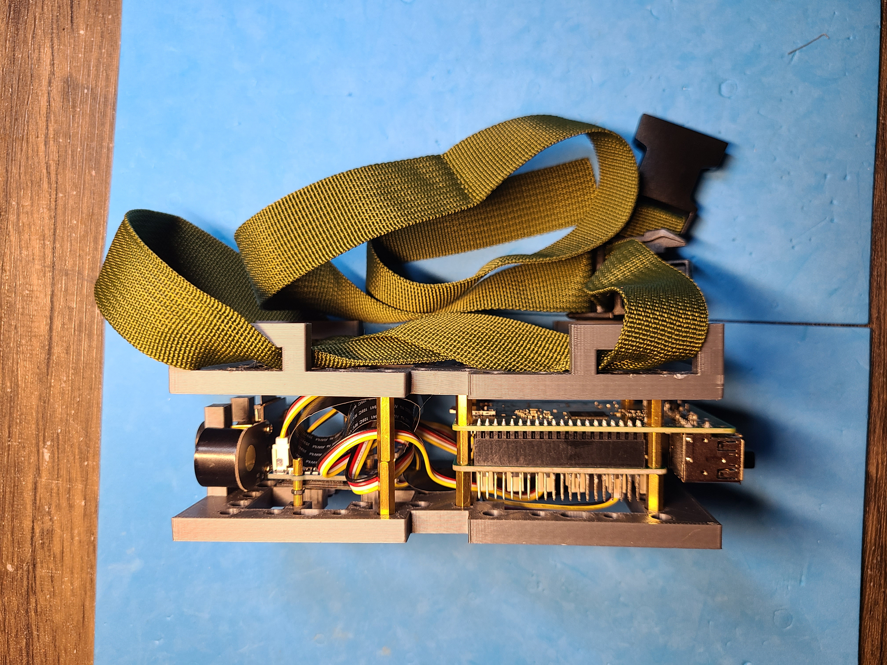
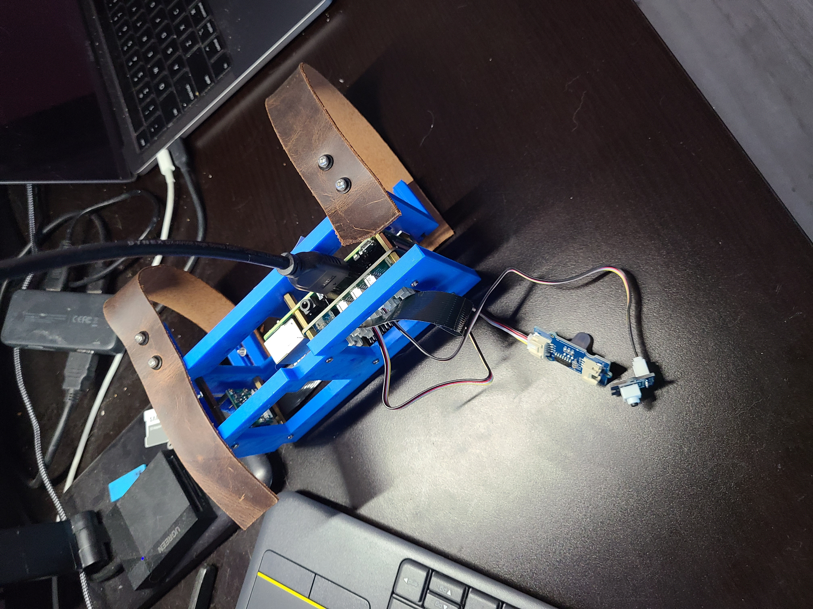
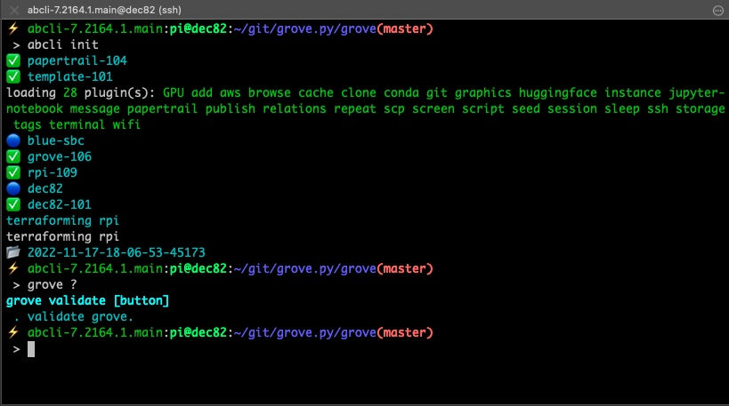

A wearable Raspberry Pi + Grove + Camera, <a href="https://github.com/kamangir/dec82">more</a>.
<a href="https://wiki.seeedstudio.com/Grove_System/">Grove</a>: <a href="https://www.seeedstudio.com/Grove-Button-P.html">button</a>: `D24`.

|  |  |  |
| --- | --- | --- |

---

# [bom](../parts.md)

1. [Grove Button](../parts.md#grove-button)
1. [Grove OLED 0.96" display](../parts.md#grove-oled-096-display)
1. [Grove Raspberry Pi Hat](../parts.md#grove-raspberry-pi-hat)
1. [Raspberry Pi Camera](../parts.md#raspberry-pi-camera)
1. [Raspberry Pi](../parts.md#raspberry-pi)

# [brackets](../brackets)

1. [gen1-dbb](../brackets/gen1-dbb/gen1-dbb.stl)
1. [gen1-dbg](../brackets/gen1-dbg/gen1-dbg.stl)

