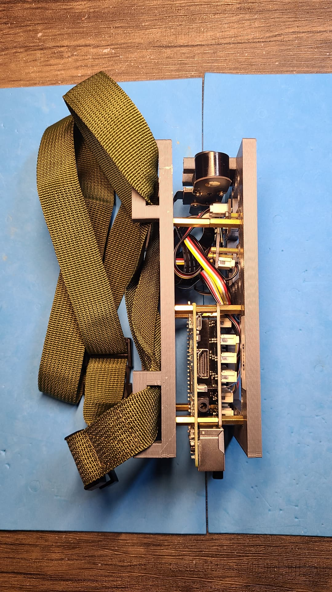

A Raspberry Pi robot based on <a href="https://projects.raspberrypi.org/en/projects/build-a-buggy/0">build-a-buggy</a> that uses <a href="https://gpiozero.readthedocs.io/en/stable/index.html">gpiozero</a> - also see <a href="https://www.waveshare.com/wiki/BuildMecar-Kit">BuildMecar-Kit</a>.

|  |  |  |
| --- | --- | --- |

---

# [bom](../parts.md)

1. [Grove Button](../parts.md#grove-button)
1. [Grove RGB LED](../parts.md#grove-rgb-led)
1. [Grove Raspberry Pi Hat](../parts.md#grove-raspberry-pi-hat)
1. [Raspberry Pi Camera](../parts.md#raspberry-pi-camera)
1. [Raspberry Pi](../parts.md#raspberry-pi)

# [brackets](../brackets)

1. [gen1-dbb](../brackets/gen1-dbb/gen1-dbb.stl)
1. [gen1-dbt](../brackets/gen1-dbt/gen1-dbt.stl)

