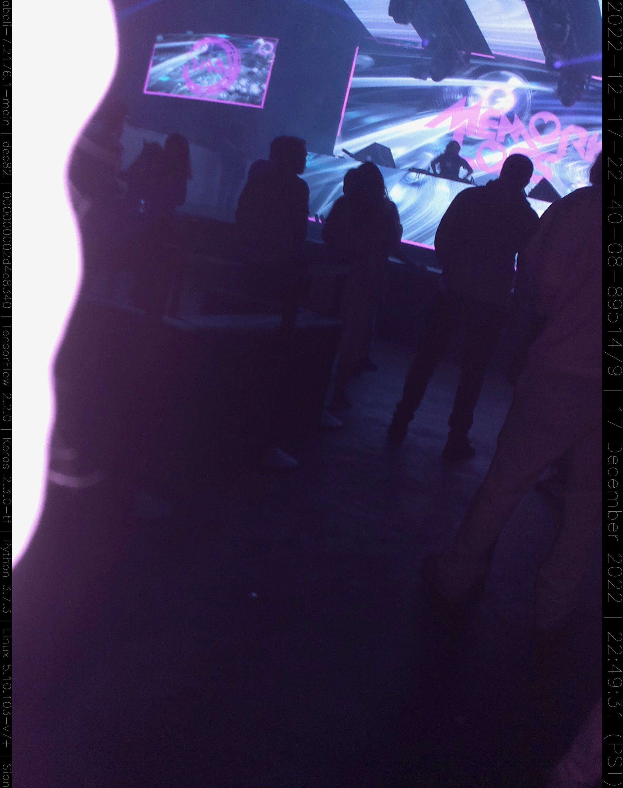
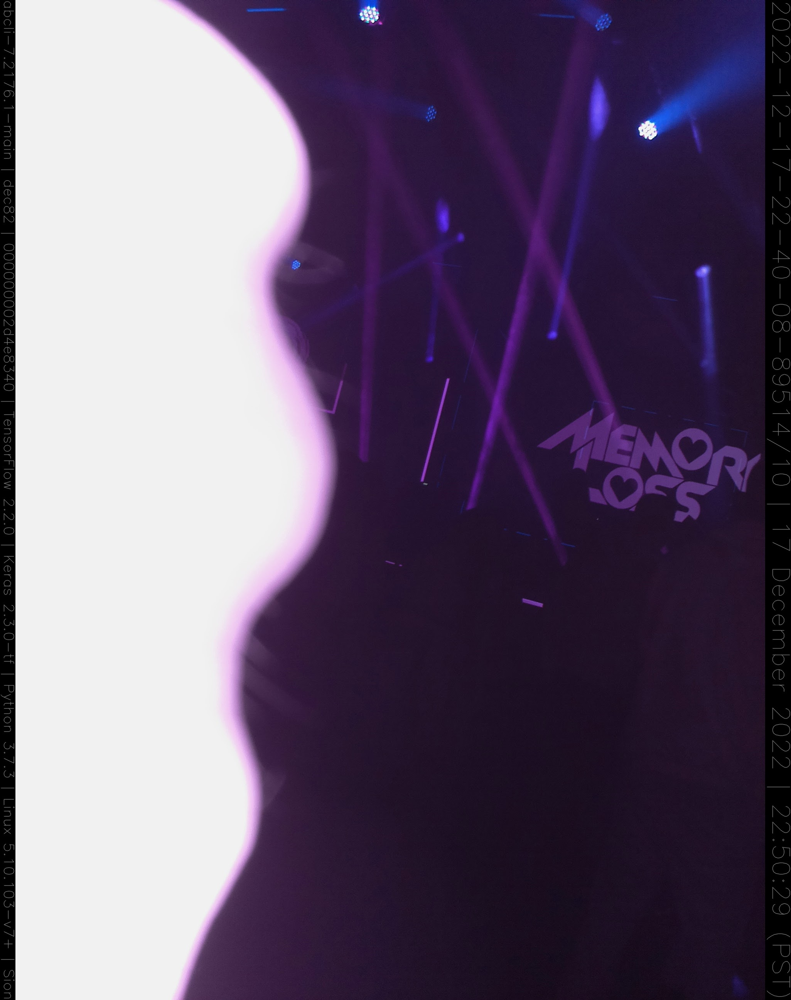
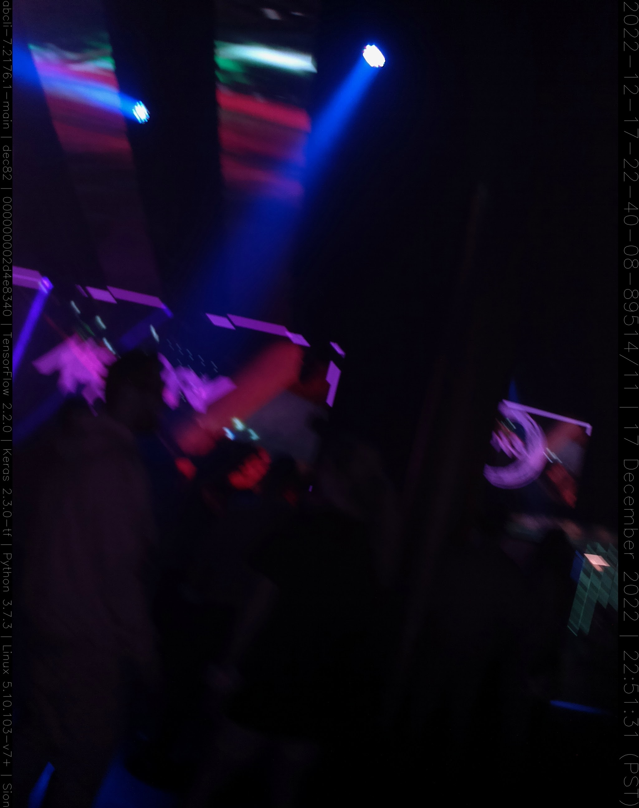
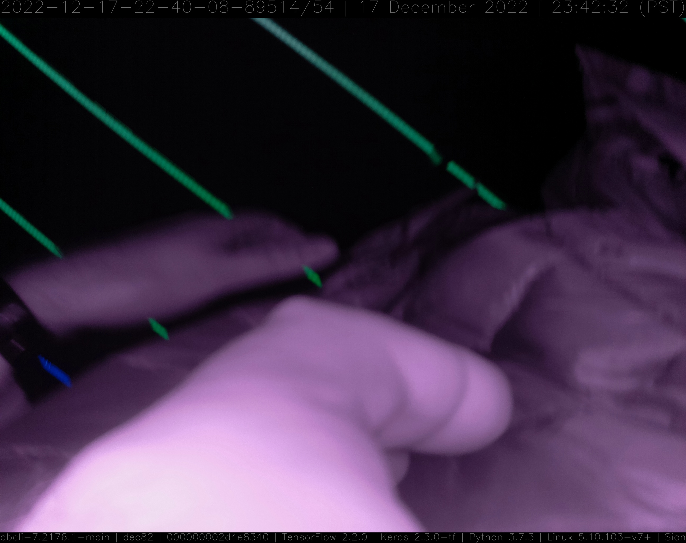

A wearable Raspberry Pi + <a href="https://wiki.seeedstudio.com/Grove_System/">Grove</a> + Camera. Python + bash <a href="https://github.com/kamangir/dec82">bootstrap</a>.

|  |  |  |
| --- | --- | --- |
|  |  |  |
|  |  |  |
|  |  |  |

---

# [bom](../parts.md)

1. [Grove Button](../parts.md#grove-button)
1. [Grove OLED 0.96" display](../parts.md#grove-oled-096-display)
1. [Grove Raspberry Pi Hat](../parts.md#grove-raspberry-pi-hat)
1. [Raspberry Pi Camera](../parts.md#raspberry-pi-camera)
1. [Raspberry Pi](../parts.md#raspberry-pi)

# [brackets](../brackets)

1. [gen1-dbgl](../brackets/gen1-dbgl/gen1-dbgl.stl)
1. [gen1-dbsl](../brackets/gen1-dbsl/gen1-dbsl.stl)

