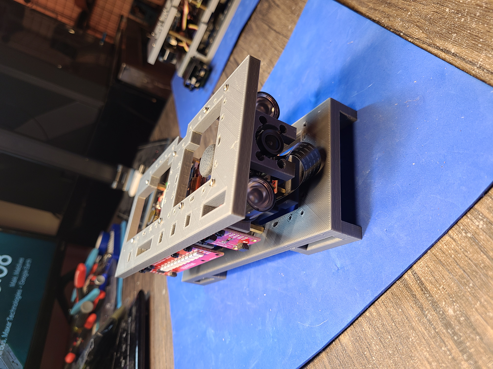

A wearable Raspberry Pi + <a href="https://www.sparkfun.com/qwiic">Qwiic</a> + Camera. Python + bash <a href="https://github.com/kamangir/dec82">bootstrap</a>.

|  |  |  |  |
| --- | --- | --- | --- |

---

# [bom](../parts.md)

1. [Qwiic 6 Degrees of Freedom Breakout](../parts.md#qwiic-6-degrees-of-freedom-breakout)
1. [Qwiic Cable](../parts.md#qwiic-cable)
1. [Qwiic Digital Temperature Sensor](../parts.md#qwiic-digital-temperature-sensor)
1. [Qwiic Joystick](../parts.md#qwiic-joystick)
1. [Qwiic LED Stick](../parts.md#qwiic-led-stick)
1. [Raspberry Pi Camera](../parts.md#raspberry-pi-camera)
1. [Raspberry Pi](../parts.md#raspberry-pi)
1. [SparkFun Top pHAT for Raspberry Pi](../parts.md#sparkfun-top-phat-for-raspberry-pi)

# [brackets](../brackets)

1. [gen1-dbbq](../brackets/gen1-dbbq/gen1-dbbq.stl)
1. [gen1-dbtq](../brackets/gen1-dbtq/gen1-dbtq.stl)

