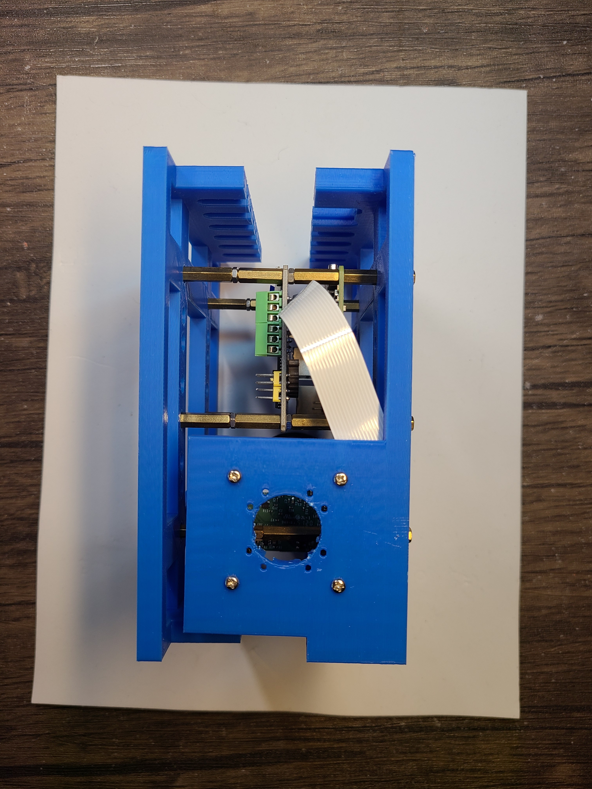
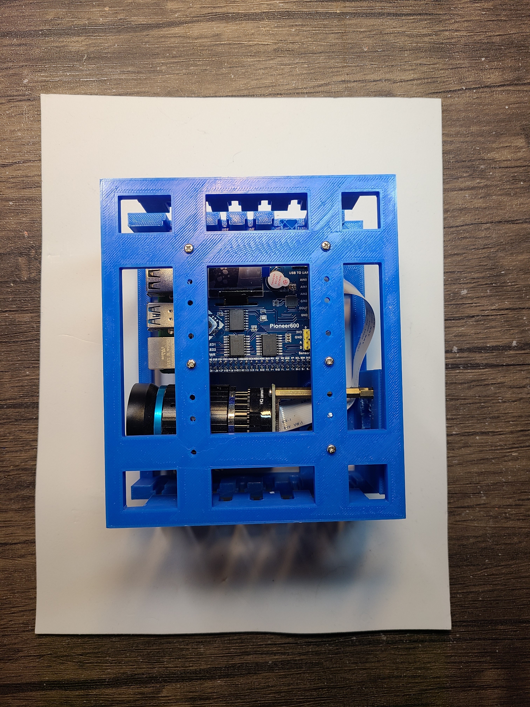
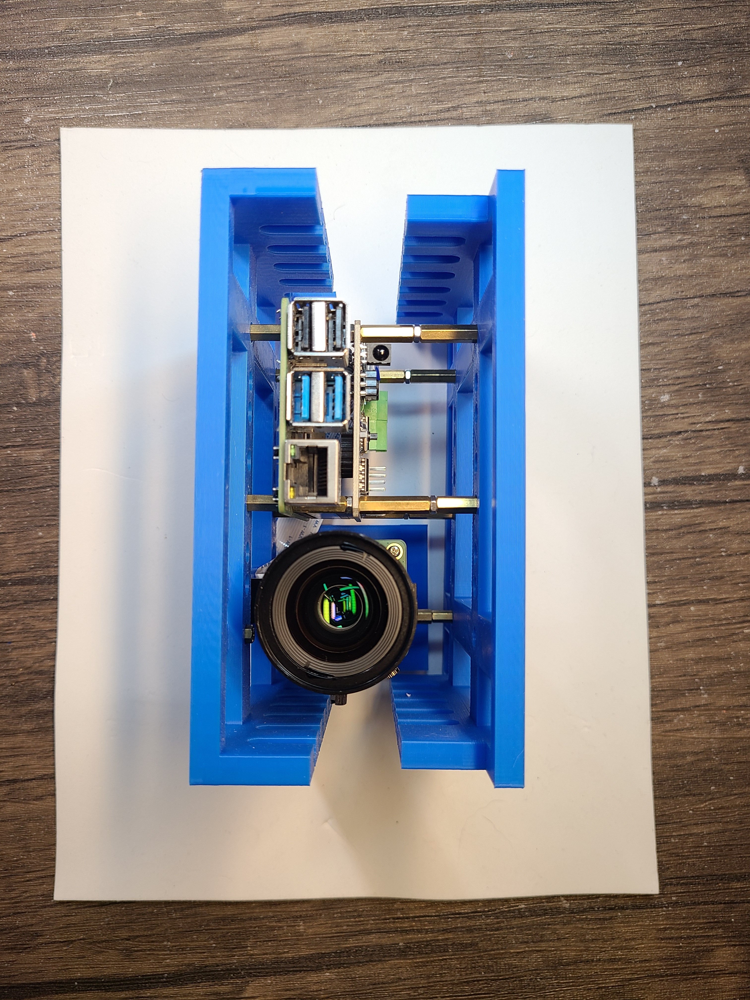

Python + bash <a href="https://github.com/kamangir/blue-sbc">bootstrap</a> for edge computing on single board computers.

|  |  |  |  |
| --- | --- | --- | --- |

---

# [bom](../parts.md)

1. [Pioneer600 Raspberry Pi Expansion Board](../parts.md#pioneer600-raspberry-pi-expansion-board)
1. [Raspberry Pi High Quality Camera](../parts.md#raspberry-pi-high-quality-camera)
1. [Raspberry Pi](../parts.md#raspberry-pi)

# [brackets](../brackets)

1. [gen3-scwx](../brackets/gen3-scwx/gen3-scwx.stl)
1. [gen3-sswx](../brackets/gen3-sswx/gen3-sswx.stl)

# release note
~2023-05-25, Vancouver 🌈.
