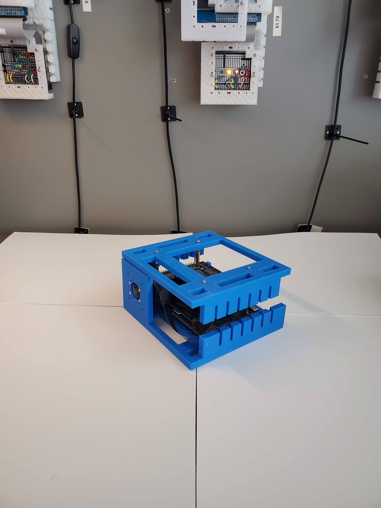
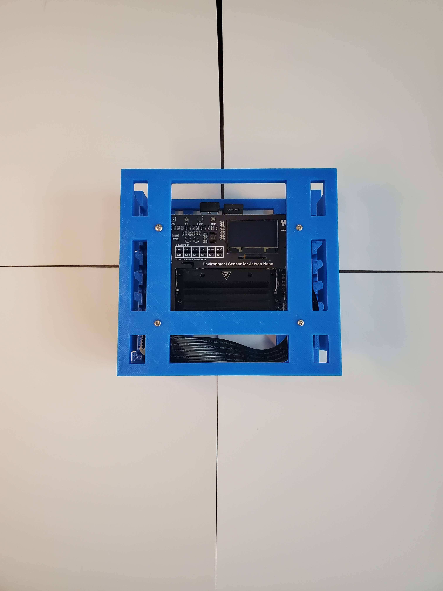
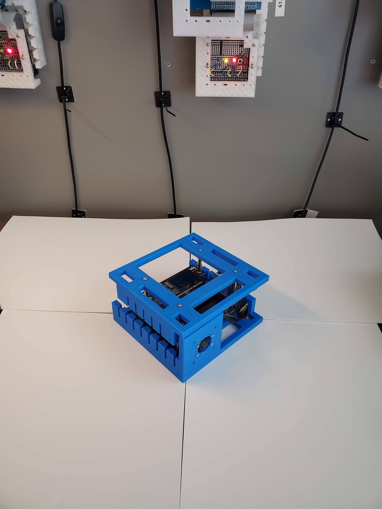

Python + bash <a href="https://github.com/kamangir/blue-sbc">bootstrap</a> for edge computing on single board computers.

|  |  |  |  |
| --- | --- | --- | --- |

---

# [bom](../parts.md)

1. [Jetson Nano Wideangle Camera](../parts.md#jetson-nano-wideangle-camera)
1. [Jetson Nano](../parts.md#jetson-nano)
1. [Waveshare 1.3" OLED Display for Jetson Nano](../parts.md#waveshare-13-oled-display-for-jetson-nano)

# [brackets](../brackets)

1. [gen3-scx](../brackets/gen3-scx/gen3-scx.stl)
1. [gen3-sdx](../brackets/gen3-sdx/gen3-sdx.stl)

