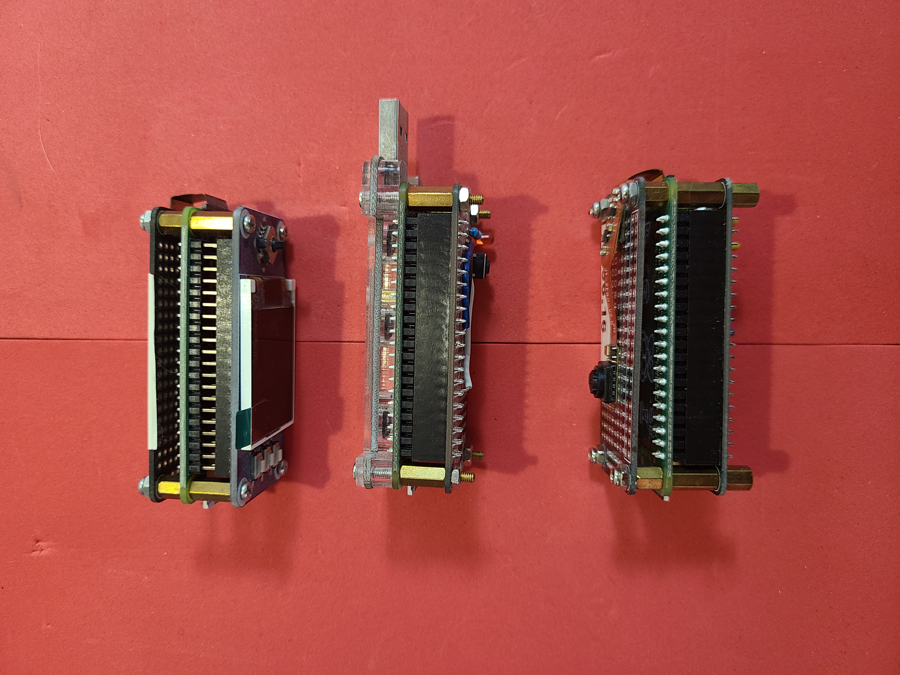

Python + bash <a href="https://github.com/kamangir/blue-sbc">bootstrap</a> for edge computing on single board computers.

|  |  |  |  |  |
| --- | --- | --- | --- | --- |
|  |  |  |  |  |
|  |  |  |  |  |

---

# [bom](../parts.md)

1. [Raspberry Pi Zero](../parts.md#raspberry-pi-zero)
1. [Zero Spy Camera for Raspberry Pi Zero](../parts.md#zero-spy-camera-for-raspberry-pi-zero)

# [brackets](../brackets)

