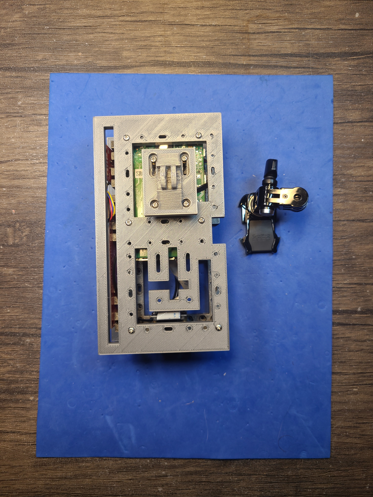

Python + bash <a href="https://github.com/kamangir/blue-sbc">bootstrap</a> for edge computing on single board computers.

|  |  |  |
| --- | --- | --- |
|  |  |  |
|  |  |  |

---

# [bom](../parts.md)

1. [Adafruit BrainCraft hat](../parts.md#adafruit-braincraft-hat)
1. [Qwiic 6 Degrees of Freedom Breakout](../parts.md#qwiic-6-degrees-of-freedom-breakout)
1. [Qwiic Cable](../parts.md#qwiic-cable)
1. [Qwiic LED Stick](../parts.md#qwiic-led-stick)
1. [Raspberry Pi Camera](../parts.md#raspberry-pi-camera)
1. [Raspberry Pi](../parts.md#raspberry-pi)

# [brackets](../brackets)

1. [gen1-dbq](../brackets/gen1-dbq/gen1-dbq.stl)
1. [gen1-dfq](../brackets/gen1-dfq/gen1-dfq.stl)
1. [gen3-g2qx](../brackets/gen3-g2qx/gen3-g2qx.stl)

