Hardware for <a href="https://rawartists.com/vancouver/portal">RAW Vancouver: Portal</a>, see <a href="https://github.com/kamangir/RAW-Vancouver-PORTAL-2022">this repo</a> for more details + code.

|  |  |  |  | [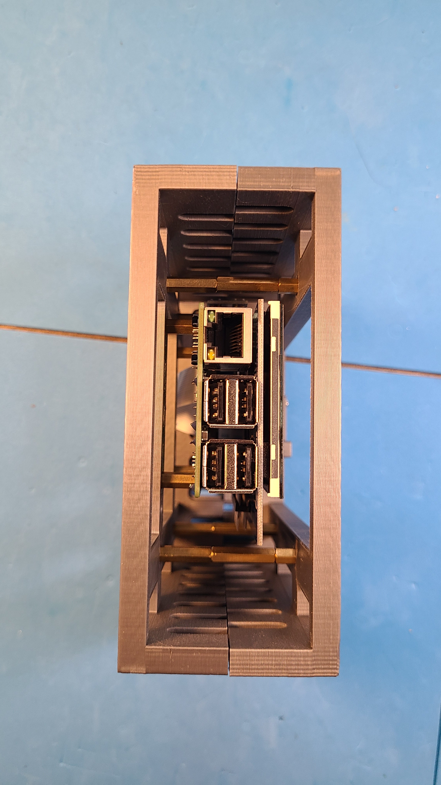](https://github.com/kamangir/blue-bracket/blob/main/images/portal-5.jpg) |
| --- | --- | --- | --- | --- |
| [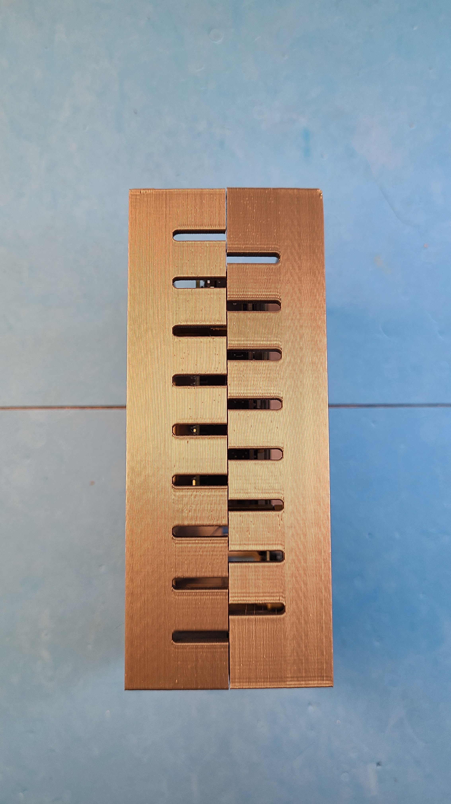](https://github.com/kamangir/blue-bracket/blob/main/images/portal-6.jpg) | [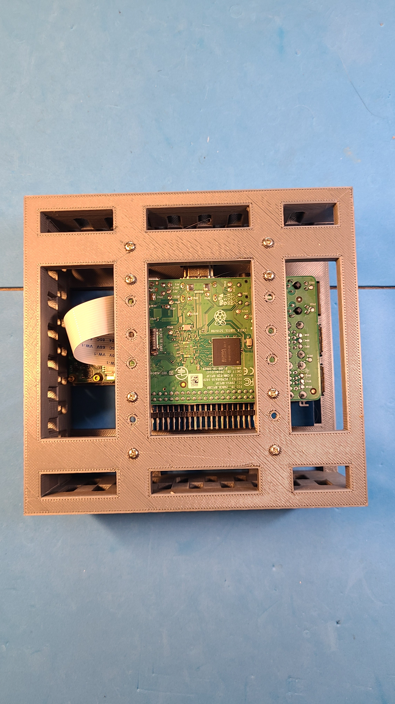](https://github.com/kamangir/blue-bracket/blob/main/images/portal-7.jpg) | [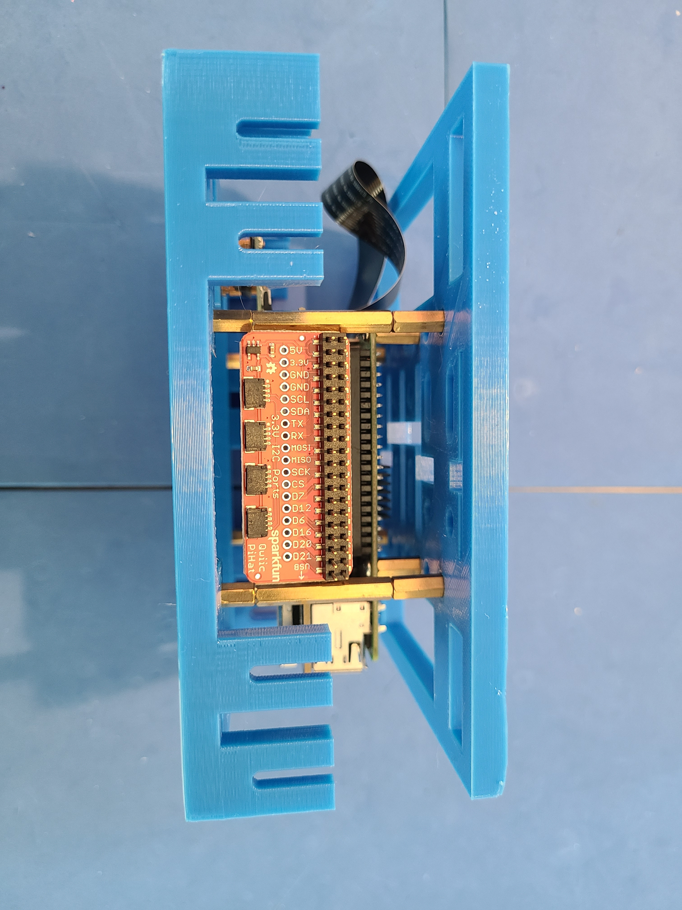](https://github.com/kamangir/blue-bracket/blob/main/images/portal-8.jpg) | [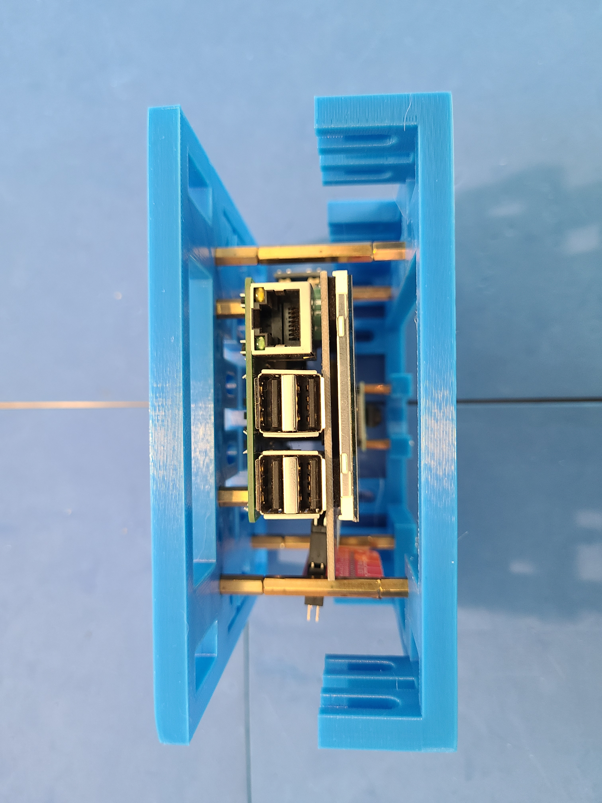](https://github.com/kamangir/blue-bracket/blob/main/images/portal-9.jpg) | [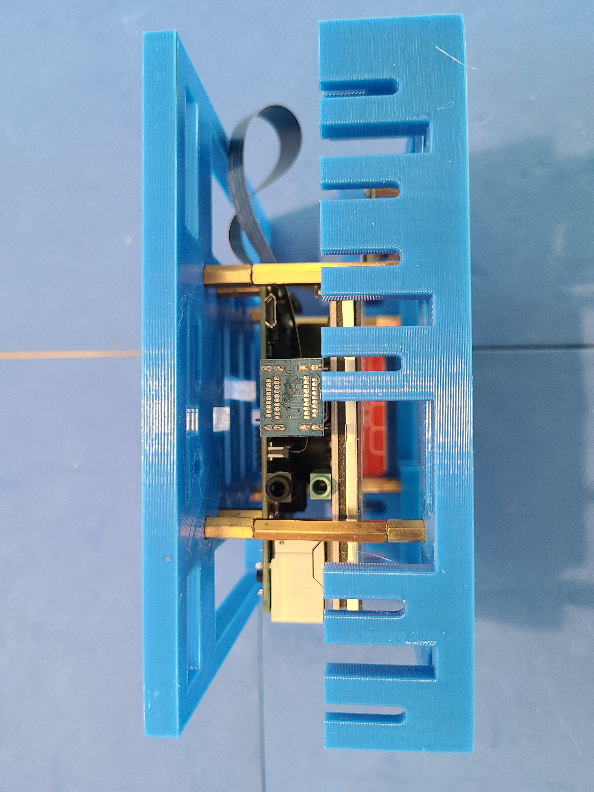](https://github.com/kamangir/blue-bracket/blob/main/images/portal-10.jpg) |
| [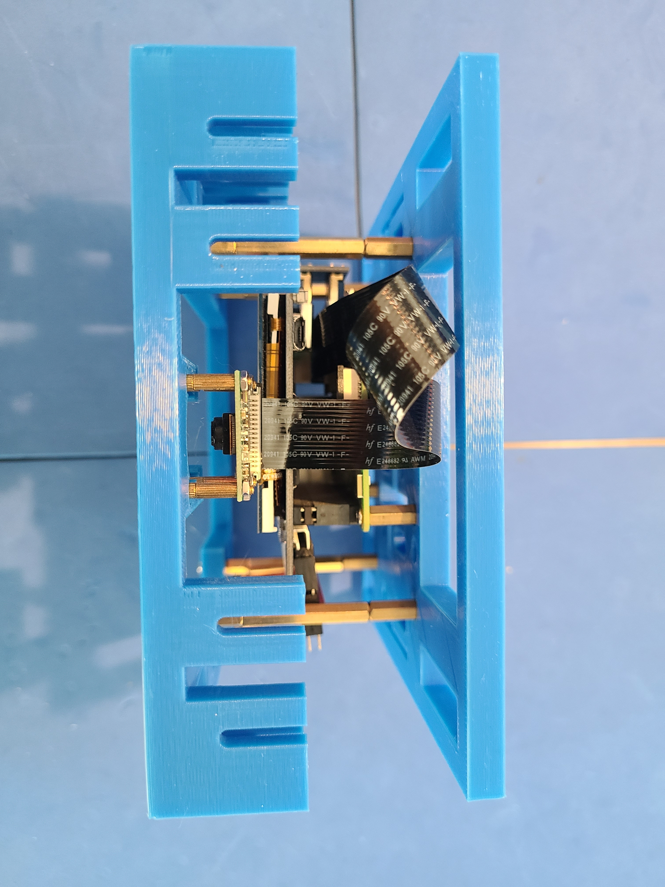](https://github.com/kamangir/blue-bracket/blob/main/images/portal-11.jpg) |  | [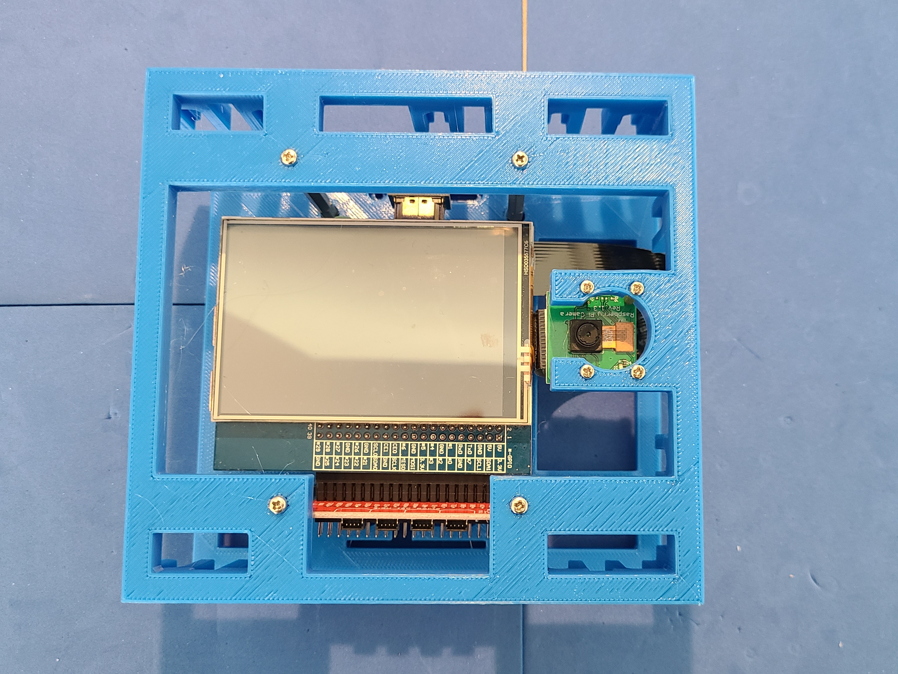](https://github.com/kamangir/blue-bracket/blob/main/images/portal-13.jpg) |  |  |
| [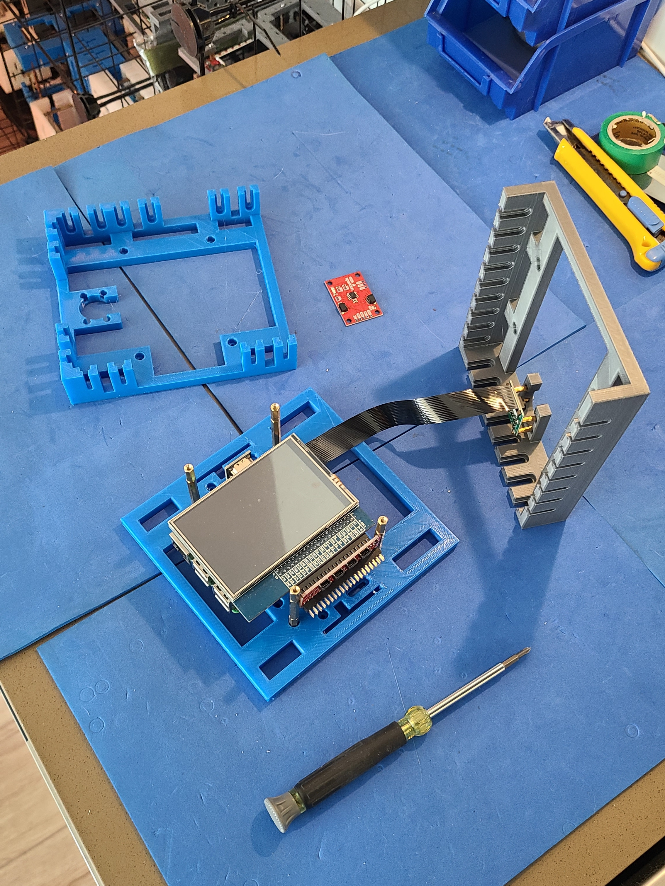](https://github.com/kamangir/blue-bracket/blob/main/images/portal-16.jpg) |  | [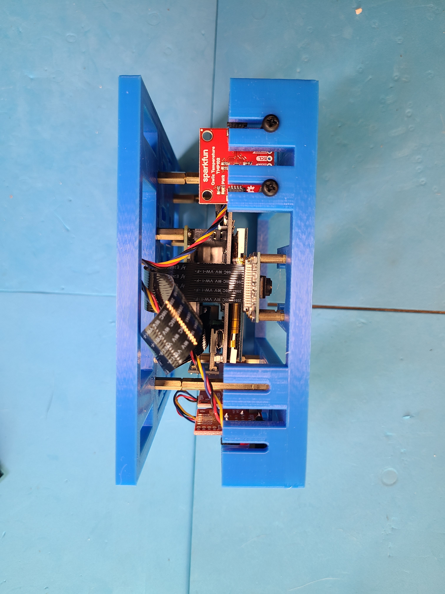](https://github.com/kamangir/blue-bracket/blob/main/images/portal-18.jpg) | [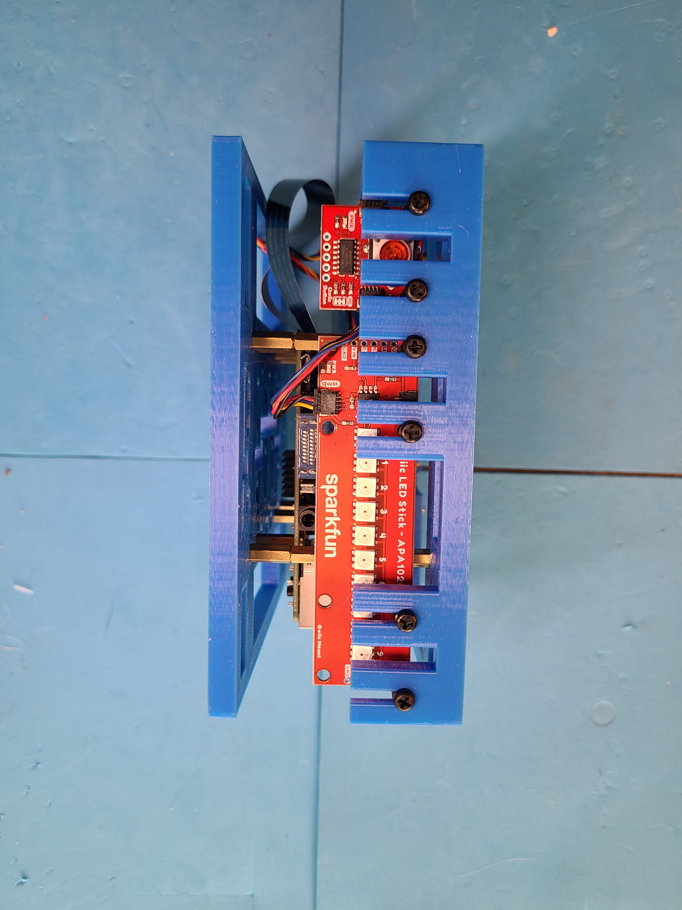](https://github.com/kamangir/blue-bracket/blob/main/images/portal-19.jpg) | [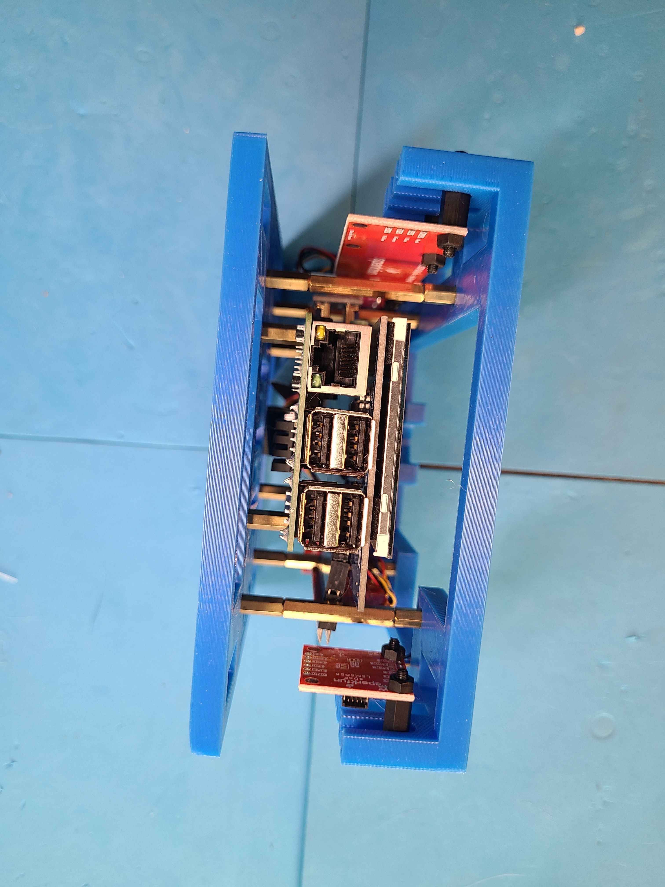](https://github.com/kamangir/blue-bracket/blob/main/images/portal-20.jpg) |
|  | [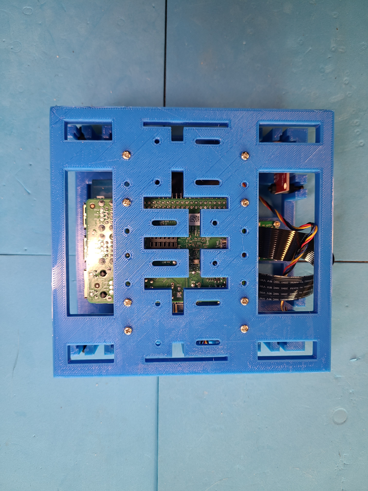](https://github.com/kamangir/blue-bracket/blob/main/images/portal-22.jpg) |  |  |  |
|  |  |  |  |  |
|  |  |  |  |  |
|  |  |  |  |  |
|  |  |  |  |  |

---

# [bom](../parts.md)

1. [Qwiic 6 Degrees of Freedom Breakout](../parts.md#qwiic-6-degrees-of-freedom-breakout)
1. [Qwiic Cable](../parts.md#qwiic-cable)
1. [Qwiic Digital Temperature Sensor](../parts.md#qwiic-digital-temperature-sensor)
1. [Qwiic Joystick](../parts.md#qwiic-joystick)
1. [Qwiic LED Stick](../parts.md#qwiic-led-stick)
1. [Raspberry Pi 3.5" Display](../parts.md#raspberry-pi-35-display)
1. [Raspberry Pi Camera](../parts.md#raspberry-pi-camera)
1. [Raspberry Pi](../parts.md#raspberry-pi)
1. [SparkFun Qwiic HAT for Raspberry Pi](../parts.md#sparkfun-qwiic-hat-for-raspberry-pi)

# [brackets](../brackets)

1. [gen3-sftq2x](../brackets/gen3-sftq2x/gen3-sftq2x.stl)
1. [gen3-sftx](../brackets/gen3-sftx/gen3-sftx.stl)
1. [gen3-sktqx](../brackets/gen3-sktqx/gen3-sktqx.stl)
1. [gen3-sktx](../brackets/gen3-sktx/gen3-sktx.stl)
1. [gen3-sotx](../brackets/gen3-sotx/gen3-sotx.stl)

# [release note](../releases.md)
[2023-07-26](https://medium.com/@arash-kamangir/cv-update-and-portal-release-73ee08ac36d1), Vancouver 🌈.
