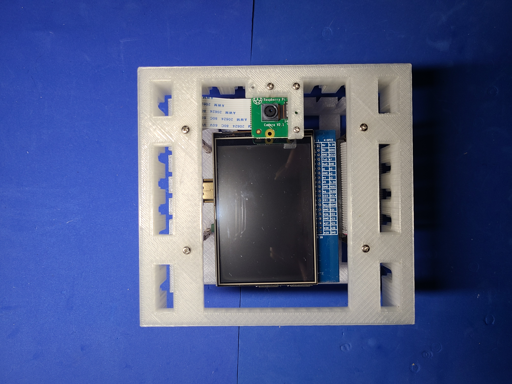
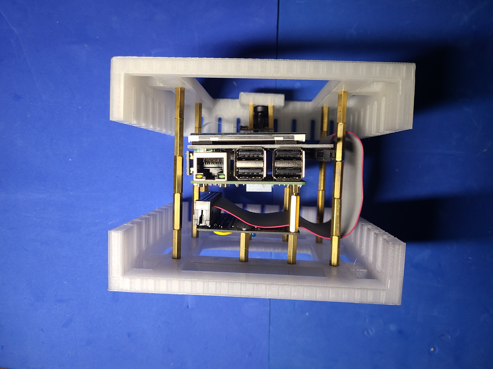
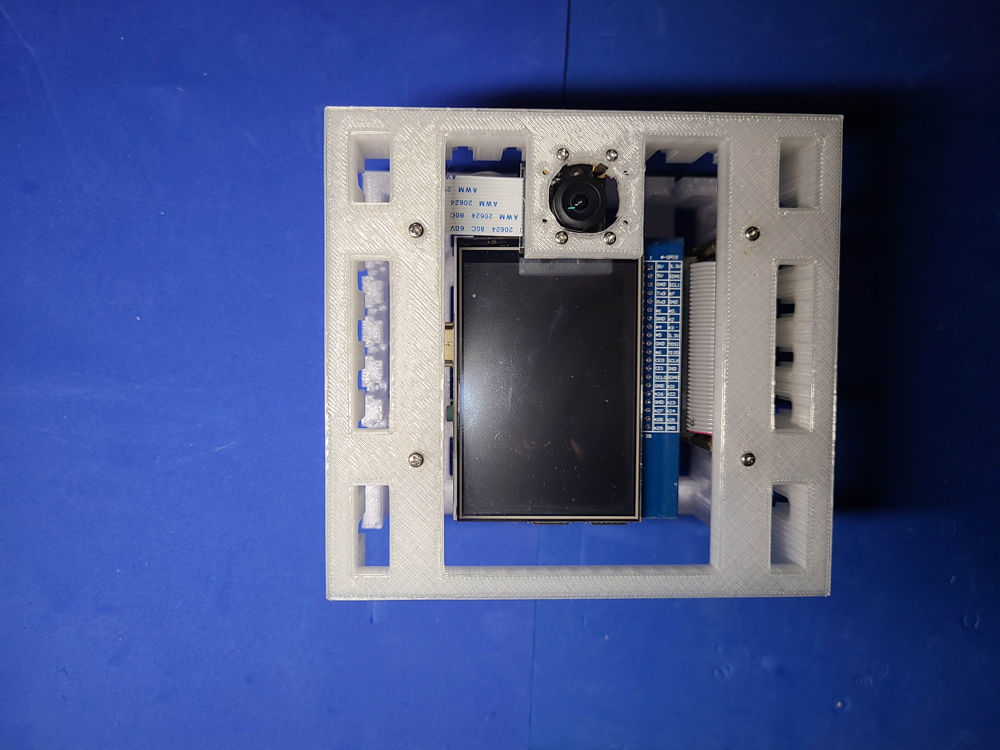

Hardware for <a href="https://rawartists.com/vancouver/portal">RAW Vancouver: Portal</a>, see <a href="https://github.com/kamangir/RAW-Vancouver-PORTAL-2022">this repo</a> for more details + code.
The `t`all variants yield a more compact build. 

|  |  |  |
| --- | --- | --- |

---

# [bom](../parts.md)

1. [Raspberry Pi 3.5" Display](../parts.md#raspberry-pi-35-display)
1. [Raspberry Pi Camera](../parts.md#raspberry-pi-camera)
1. [Raspberry Pi](../parts.md#raspberry-pi)

# [brackets](../brackets)

1. [gen3-shtx](../brackets/gen3-shtx/gen3-shtx.stl)
1. [gen3-shx](../brackets/gen3-shx/gen3-shx.stl)
1. [gen3-sitx](../brackets/gen3-sitx/gen3-sitx.stl)
1. [gen3-six](../brackets/gen3-six/gen3-six.stl)
1. [gen3-sotx](../brackets/gen3-sotx/gen3-sotx.stl)
1. [gen3-sx](../brackets/gen3-sx/gen3-sx.stl)

