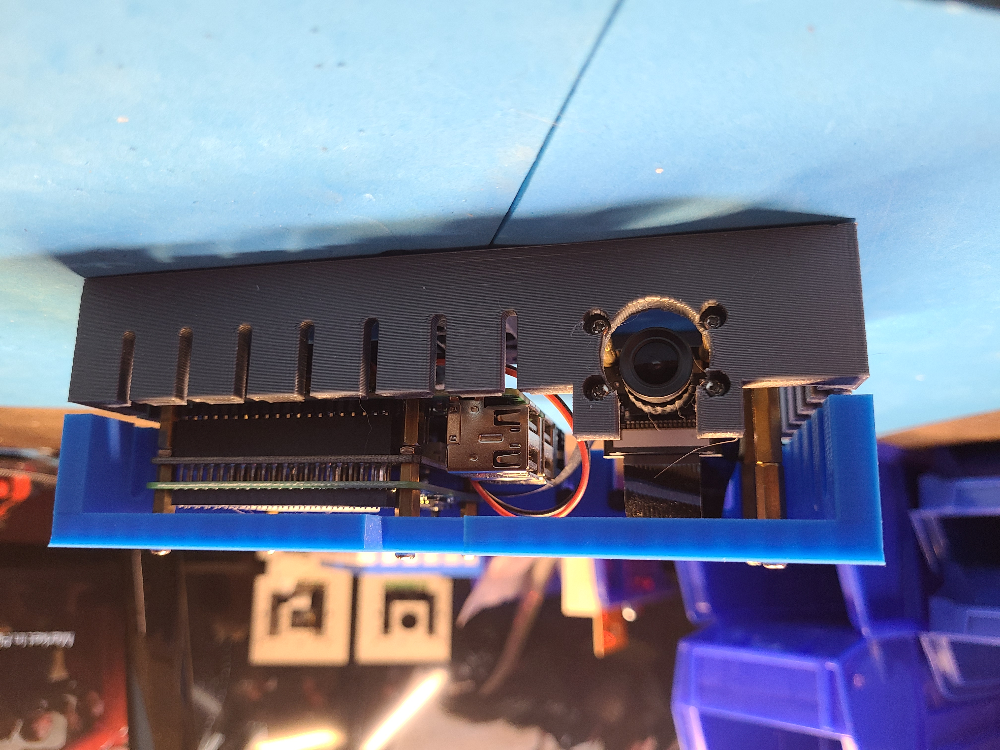
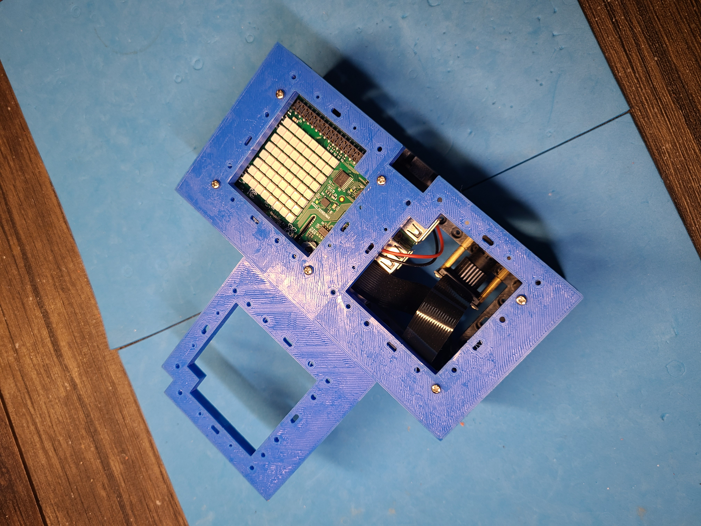
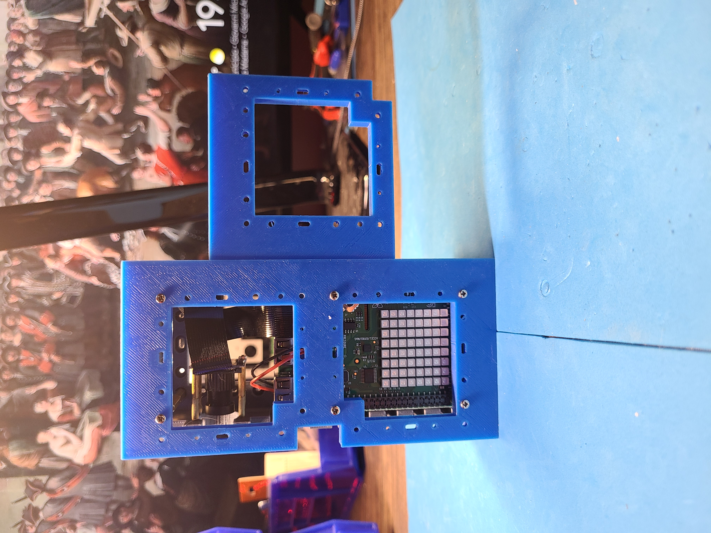
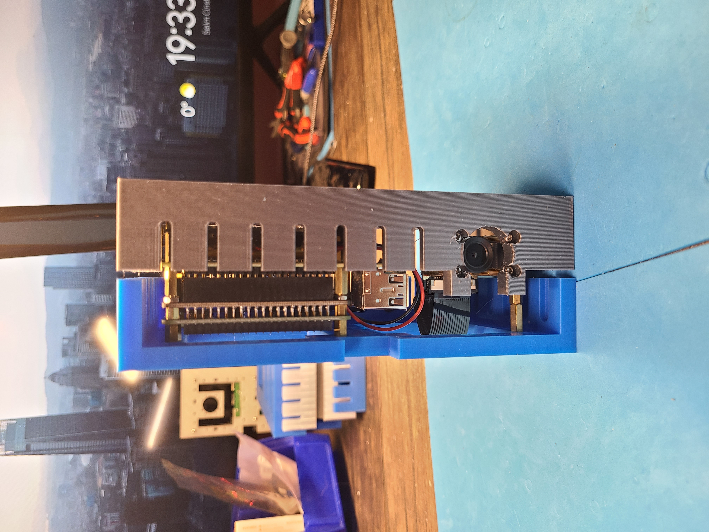

Python + bash <a href="https://github.com/kamangir/blue-sbc">bootstrap</a> for edge computing on single board computers.

|  |  |  |
| --- | --- | --- |
|  |  |  |

---

# [bom](../parts.md)

1. [MakerFocus Raspberry Pi UPS Hat](../parts.md#makerfocus-raspberry-pi-ups-hat)
1. [Raspberry Pi Camera](../parts.md#raspberry-pi-camera)
1. [Raspberry Pi Sense HAT](../parts.md#raspberry-pi-sense-hat)
1. [Raspberry Pi](../parts.md#raspberry-pi)

# [brackets](../brackets)

1. [gen1-d](../brackets/gen1-d/gen1-d.stl)
1. [gen1-de](../brackets/gen1-de/gen1-de.stl)
1. [gen1-s](../brackets/gen1-s/gen1-s.stl)

