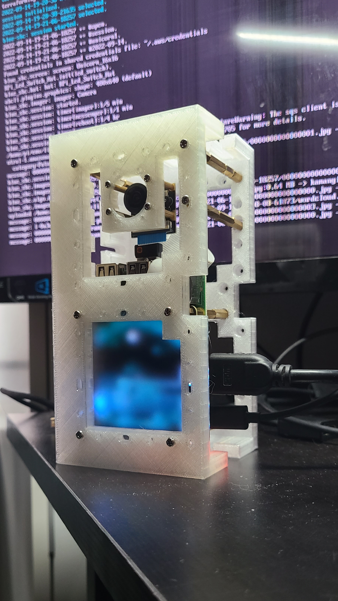
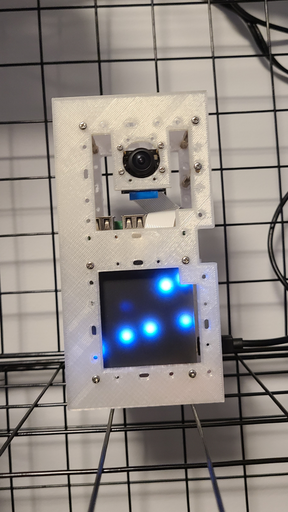

Python + bash <a href="https://github.com/kamangir/blue-sbc">bootstrap</a> for edge computing on single board computers.

|  |  |  |
| --- | --- | --- |
|  |  |  |

---

# [bom](../parts.md)

1. [Raspberry Pi Camera](../parts.md#raspberry-pi-camera)
1. [Raspberry Pi](../parts.md#raspberry-pi)
1. [Unicorn HAT HD](../parts.md#unicorn-hat-hd)

# [brackets](../brackets)

1. [gen1-d](../brackets/gen1-d/gen1-d.stl)
1. [gen1-df](../brackets/gen1-df/gen1-df.stl)
1. [gen1-dk-pi](../brackets/gen1-dk-pi/gen1-dk-pi.stl)
1. [gen1-dk](../brackets/gen1-dk/gen1-dk.stl)

