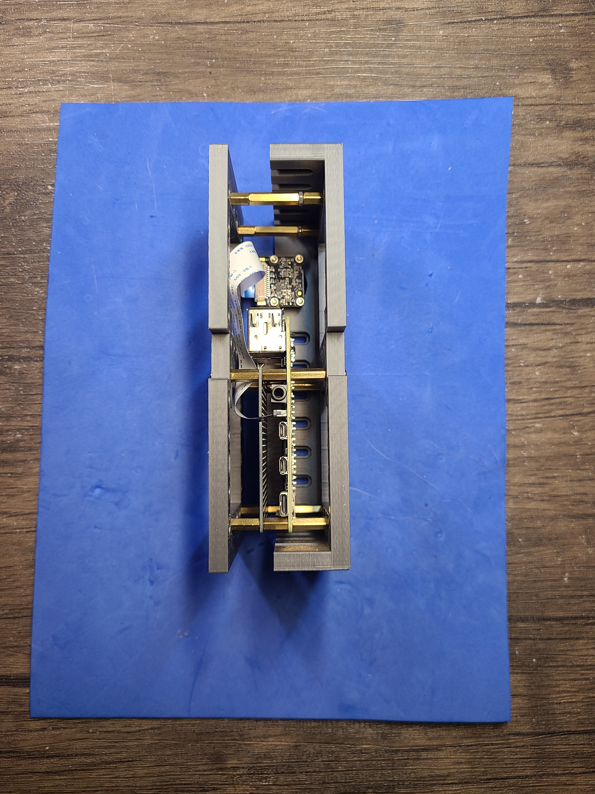

Python + bash <a href="https://github.com/kamangir/blue-sbc">bootstrap</a> for edge computing on single board computers.

|  |  |  |
| --- | --- | --- |

---

# [bom](../parts.md)

1. [Raspberry Pi Camera](../parts.md#raspberry-pi-camera)
1. [Raspberry Pi](../parts.md#raspberry-pi)

# [brackets](../brackets)

1. [gen1-de](../brackets/gen1-de/gen1-de.stl)
1. [gen1-df](../brackets/gen1-df/gen1-df.stl)

