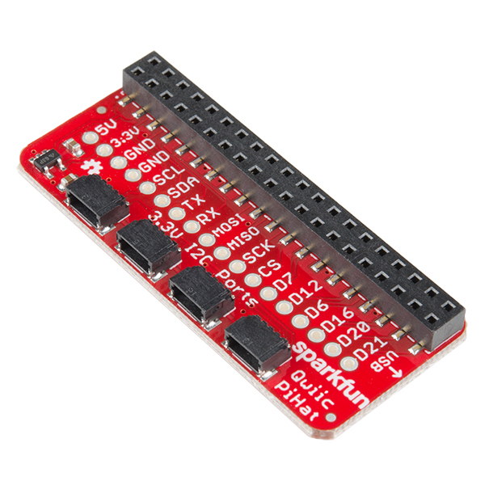

# 48mm Mecanum Wheel Pair

1. https://www.adafruit.com/product/4990
1. https://www.digikey.ca/en/products/detail/adafruit-industries-llc/4678/13148774
1. https://www.digikey.ca/en/products/detail/adafruit-industries-llc/4679/13148776

 used in : [blue-buggy](./designs/blue-buggy.md), [blue-buggy-2](./designs/blue-buggy-2.md)

---

# 65mm White Wheel for TT DC Gearbox Motors

1. https://www.adafruit.com/product/3763

 used in : [blue-jetbot](./designs/blue-jetbot.md)

---

# Adafruit 13x9 PWM RGB LED Matrix Driver Qwiic

1. https://learn.adafruit.com/adafruit-is31fl3741
1. https://learn.adafruit.com/assets/104577
1. https://www.adafruit.com/product/5201
1. https://www.digikey.ca/en/products/detail/adafruit-industries-llc/5201/15216796

 used in : [2x13x9](./designs/2x13x9.md)

---

# Adafruit BrainCraft hat

1. https://media.digikey.com/pdf/Data%20Sheets/Adafruit%20PDFs/4374_Web.pdf
1. https://www.adafruit.com/product/4374
1. https://www.digikey.ca/en/products/detail/adafruit-industries-llc/4374/13180680

 used in : [cube](./designs/cube.md), [helmet](./designs/helmet.md)

---

# Adafruit DC and Stepper Motor Bonnet for Raspberry Pi

1. https://www.adafruit.com/product/4280

 used in : [blue-buggy](./designs/blue-buggy.md), [blue-buggy-2](./designs/blue-buggy-2.md), [blue-donkey](./designs/blue-donkey.md)

---

# Adafruit RGB LED Matrix

1. https://cdn-learn.adafruit.com/downloads/pdf/adafruit-rgb-matrix-plus-real-time-clock-hat-for-raspberry-pi.pdf
1. https://learn.adafruit.com/32x16-32x32-rgb-led-matrix
1. https://learn.adafruit.com/adafruit-rgb-matrix-plus-real-time-clock-hat-for-raspberry-pi
1. https://www.digikey.ca/en/products/detail/adafruit-industries-llc/2026/7035028
1. https://www.digikey.ca/en/products/detail/adafruit-industries-llc/2277/7035035

 used in : [nurah](./designs/nurah.md)

---

# Adafruit RGB Matrix Hat

1. https://cdn-learn.adafruit.com/downloads/pdf/adafruit-rgb-matrix-plus-real-time-clock-hat-for-raspberry-pi.pdf
1. https://learn.adafruit.com/adafruit-rgb-matrix-plus-real-time-clock-hat-for-raspberry-pi
1. https://www.digikey.ca/en/products/detail/adafruit-industries-llc/2345/5699181

related:
1. https://www.digikey.ca/en/products/detail/adafruit-industries-llc/658/5774322

 used in : [nurah](./designs/nurah.md)

---

# Adafruit TB6612 1.2A DC Stepper Motor Driver Breakout Board

1. https://www.adafruit.com/product/2448
1. https://www.pishop.ca/product/adafruit-tb6612-1-2a-dcstepper-motor-driver-breakout-board/

 used in : [blue-donkey](./designs/blue-donkey.md)

---

# DC Gearbox Motor - TT Motor

1. https://www.adafruit.com/product/3777
1. https://www.adafruit.com/product/3801
1. https://www.adafruit.com/product/3802

 used in : [blue-jetbot](./designs/blue-jetbot.md), [blue-buggy](./designs/blue-buggy.md), [blue-buggy-2](./designs/blue-buggy-2.md)

---

# DFRobot 5" Display

1. https://media.digikey.com/pdf/Data%20Sheets/DFRobot%20PDFs/DFR0550_Web.pdf
1. https://www.dfrobot.com/product-1784.html
1. https://www.digikey.ca/en/products/detail/dfrobot/DFR0550/9608214

 used in : [blue3](./designs/blue3.md), [blue4](./designs/blue4.md)

---

# DFRobot GPS USB

1. https://www.digikey.ca/en/products/detail/dfrobot/TEL0137/13978513

 used in : [blue-buggy](./designs/blue-buggy.md), [blue-buggy-2](./designs/blue-buggy-2.md), [blue-donkey](./designs/blue-donkey.md), [blue1](./designs/blue1.md)

---

# DFRobot I2C 16X2 RGB LCD Keypad Hat

1. https://www.dfrobot.com/product-1885.html
1. https://www.digikey.ca/en/products/detail/dfrobot/DFR0514/15997375

 used in : [scooter](./designs/scooter.md)

---

# DFRobot Jetson Nano UPS Hat

1. https://wiki.dfrobot.com/UPS_HAT_for_Jetson_Nano_SKU_DFR0865
1. https://www.dfrobot.com/product-2342.html
1. https://www.digikey.ca/en/products/detail/dfrobot/DFR0865/14824938
1. https://www.robotshop.com/ca/en/ups-hat-for-jetson-nano.html

 used in : [blue-donkey](./designs/blue-donkey.md)

---

# Exceed Fire Blue RC Buggy 1/16 2.4Ghz

1. https://p11.secure.hostingprod.com/@hobbypartz.com/ssl/ibuyrc/manual/51C852.pdf
1. https://www.nitrorcx.com/51c852-fireblue-24ghz.html

 used in : [blue-donkey](./designs/blue-donkey.md)

---

# Flick Large 3D Tracking & Gesture Module

1. https://www.robotshop.com/ca/en/flick-hat-3d-tracking-gesture-raspberry-pi.html
1. https://www.robotshop.com/ca/en/flick-large-3d-tracking-gesture-module.html

 used in : [cube](./designs/cube.md)

---

# Grove Button

1. http://www.seeedstudio.com/document/pdf/Introduction%20to%20Grove.pdf
1. https://www.digikey.ca/en/products/detail/seeed-technology-co-ltd/111020000/5487957
1. https://www.seeedstudio.com/Grove-Button-P.html

 used in : [blue3](./designs/blue3.md), [chenar-grove](./designs/chenar-grove.md), [dec82](./designs/dec82.md)

---

# Grove Light Sensor

1. https://www.digikey.ca/en/products/detail/seeed-technology-co-ltd/101020030/5482599

 used in : [chenar-grove](./designs/chenar-grove.md)

---

# Grove OLED 0.96" display

1. https://wiki.seeedstudio.com/Grove-OLED_Display_0.96inch/
1. https://www.digikey.ca/en/products/detail/seeed-technology-co-ltd/104020249/14672108

 used in : [dec82](./designs/dec82.md)

---

# Grove Raspberry Pi Hat

1. https://media.digikey.com/pdf/Data%20Sheets/Seeed%20Technology/Grove_Base_Hat_for_Raspberry_Pi_Web.pdf
1. https://www.digikey.ca/en/products/detail/seeed-technology-co-ltd/103030275/9771826
1. https://www.digikey.ca/en/products/detail/seeed-technology-co-ltd/103030276/9771828

 used in : [blue3](./designs/blue3.md), [chenar-grove](./designs/chenar-grove.md), [dec82](./designs/dec82.md)

---

# Grove Relay

1. https://raw.githubusercontent.com/SeeedDocument/Grove-Relay/master/res/Relay_Datasheet.pdf
1. https://www.digikey.ca/en/products/detail/seeed-technology-co-ltd/103020005/5487965
1. https://www.seeedstudio.com/Grove-Relay.html

 used in : [chenar-grove](./designs/chenar-grove.md)

---

# Grove RGB LED

1. https://media.digikey.com/pdf/Data%20Sheets/Seeed%20Technology/104020048_Web.pdf
1. https://www.digikey.ca/en/products/detail/seeed-technology-co-ltd/104020048/7622878
1. https://www.seeedstudio.com/Grove-Chainable-RGB-Led-V2-0.html

related:
1. https://www.seeedstudio.com/Grove-Chainable-RGB-LED.html

 used in : [chenar-grove](./designs/chenar-grove.md)

---

# Grove Soil Sensor

1. https://media.digikey.com/pdf/Data%20Sheets/Seeed%20Technology/101020614_Web.pdf
1. https://www.digikey.ca/en/products/detail/seeed-technology-co-ltd/101020614/10451856

 used in : [chenar-grove](./designs/chenar-grove.md)

---

# Grove Temperature Sensor

1. https://media.digikey.com/pdf/Data%20Sheets/Seeed%20Technology/101020015_Web.pdf
1. https://www.digikey.ca/en/products/detail/seeed-technology-co-ltd/101020015/5482612

related:
1. https://media.digikey.com/pdf/Data%20Sheets/Seeed%20Technology/101020011_Web.pdf
1. https://www.digikey.ca/en/products/detail/seeed-technology-co-ltd/101020011/5482602
1. https://www.seeedstudio.com/Grove-Temperature-Humidity-Sensor-DHT11.html

 used in : [chenar-grove](./designs/chenar-grove.md)

---

# Grove Water Sensor

1. https://github.com/Seeed-Studio/Grove_Water_Sensor
1. https://media.digikey.com/pdf/Data%20Sheets/Seeed%20Technology/101020018_Web.pdf
1. https://www.digikey.ca/en/products/detail/seeed-technology-co-ltd/101020018/5482605
1. https://www.seeedstudio.com/Grove-Water-Sensor.html

 used in : [chenar-grove](./designs/chenar-grove.md)

---

# JetBot AI Kit Accessories

1. https://www.waveshare.com/jetbot-ai-kit-acce.htm

related:
1. https://jetbot.org/master/index.html

 used in : [blue-jetbot](./designs/blue-jetbot.md)

---

# Jetson Nano

1. https://developer.nvidia.com/embedded/jetson-nano-developer-kit

 used in : [blue-jetbot](./designs/blue-jetbot.md), [blue-donkey](./designs/blue-donkey.md), [hard_worker](./designs/hard_worker.md), [eye_nano](./designs/eye_nano.md), [chenar-nano](./designs/chenar-nano.md)

---

# Jetson Nano Wideangle Camera

1. https://www.digikey.ca/en/products/detail/seeed-technology-co-ltd/114992265/12396929

 used in : [blue-jetbot](./designs/blue-jetbot.md), [blue-donkey](./designs/blue-donkey.md), [eye_nano](./designs/eye_nano.md), [chenar-nano](./designs/chenar-nano.md)

---

# MakerFocus Raspberry Pi UPS Hat

1. https://www.amazon.com/gp/product/B01LAEX7J0/ref=ppx_od_dt_b_asin_title_s01?ie=UTF8&psc=1
1. https://www.makerfocus.com/products/raspberry-pi-expansion-board-ups-pack-standard-power-supply

related:
1. https://media.digikey.com/pdf/Data%20Sheets/DFRobot%20PDFs/DFR0494_Web.pdf
1. https://media.digikey.com/pdf/Data%20Sheets/DFRobot%20PDFs/DFR0528_Web.pdf
1. https://www.digikey.ca/en/products/detail/dfrobot/DFR0494/10279725
1. https://www.digikey.ca/en/products/detail/dfrobot/DFR0528/11202719
1. https://www.pishop.ca/product/li-ion-battery-hat-for-raspberry-pi-5v-output-quick-charge/
1. https://www.robotshop.com/ca/en/lithium-battery-power-pack-raspberry-pi-w-recharging-function.html
1. https://www.waveshare.com/wiki/Li-ion_Battery_HAT

 used in : [blue-buggy](./designs/blue-buggy.md), [blue-buggy-2](./designs/blue-buggy-2.md), [blue-donkey](./designs/blue-donkey.md), [blue1](./designs/blue1.md), [blue3](./designs/blue3.md), [blue4](./designs/blue4.md), [cube](./designs/cube.md), [blue-sense](./designs/blue-sense.md), [scooter](./designs/scooter.md), [skateboard](./designs/skateboard.md)

---

# Pioneer600 Raspberry Pi Expansion Board

1. https://www.pishop.ca/product/pioneer600-raspberry-pi-expansion-board/
1. https://www.waveshare.com/wiki/Pioneer600

 used in : [cube](./designs/cube.md), [eye_hq](./designs/eye_hq.md)

---

# Qwiic 6 Degrees of Freedom Breakout

1. https://www.digikey.ca/en/products/detail/sparkfun-electronics/SEN-18020/14313960
1. https://www.sparkfun.com/products/18020

 used in : [dec82q](./designs/dec82q.md), [portal](./designs/portal.md), [may26](./designs/may26.md), [helmet](./designs/helmet.md)

---

# Qwiic Cable

1. https://www.digikey.ca/en/products/detail/adafruit-industries-llc/5384/16546428
1. https://www.digikey.ca/en/products/detail/sparkfun-electronics/PRT-14426/7652739
1. https://www.digikey.ca/en/products/detail/sparkfun-electronics/PRT-14427/7652740

 used in : [dec82q](./designs/dec82q.md), [portal](./designs/portal.md), [may26](./designs/may26.md), [helmet](./designs/helmet.md)

---

# Qwiic Digital Temperature Sensor

1. https://www.sparkfun.com/products/16304

 used in : [dec82q](./designs/dec82q.md), [portal](./designs/portal.md), [may26](./designs/may26.md)

---

# Qwiic Joystick

1. https://www.sparkfun.com/products/15168

 used in : [dec82q](./designs/dec82q.md), [portal](./designs/portal.md), [may26](./designs/may26.md)

---

# Qwiic LED Stick

1. https://cdn.sparkfun.com/assets/learn_tutorials/1/8/2/4/Qwiic_LED_Stick-Dimensions.png
1. https://www.digikey.ca/en/products/detail/sparkfun-electronics/COM-18354/14645588
1. https://www.sparkfun.com/products/18354

 used in : [dec82q](./designs/dec82q.md), [portal](./designs/portal.md), [may26](./designs/may26.md), [helmet](./designs/helmet.md)

---

# Raspberry Pi

1. https://www.raspberrypi.org/

 used in : [blue-buggy](./designs/blue-buggy.md), [blue-buggy-2](./designs/blue-buggy-2.md), [blue-donkey](./designs/blue-donkey.md), [blue1](./designs/blue1.md), [blue3](./designs/blue3.md), [blue4](./designs/blue4.md), [chenar-grove](./designs/chenar-grove.md), [cube](./designs/cube.md), [blue-sense](./designs/blue-sense.md), [dec82](./designs/dec82.md), [dec82q](./designs/dec82q.md), [eye_hq](./designs/eye_hq.md), [portal](./designs/portal.md), [may26](./designs/may26.md), [white_elephant](./designs/white_elephant.md), [candle](./designs/candle.md), [nurah](./designs/nurah.md), [unicorn](./designs/unicorn.md), [helmet](./designs/helmet.md), [scooter](./designs/scooter.md), [skateboard](./designs/skateboard.md), [2x13x9](./designs/2x13x9.md)

---

# Raspberry Pi 3.5" Display

1. http://www.lcdwiki.com/3.5inch_RPi_Display
1. https://www.pishop.ca/product/3-5-inch-raspberry-pi-tft-display/
1. https://www.waveshare.com/wiki/3.5inch_RPi_LCD_(A)

 used in : [portal](./designs/portal.md), [may26](./designs/may26.md)

---

# Raspberry Pi Camera

1. ir: https://www.digikey.ca/en/products/detail/pimoroni-ltd/CAM008/9521978
1. ir: https://www.digikey.ca/en/products/detail/seeed-technology-co-ltd/114990837/6578355
1. noir: https://www.digikey.ca/en/products/detail/raspberry-pi/913-2673/6152811
1. rgb: https://www.digikey.ca/en/products/detail/dfrobot/SEN0173/6588626
1. rgb: https://www.digikey.ca/en/products/detail/raspberry-pi/913-2664/6152810
1. wide-angle: https://www.digikey.ca/en/products/detail/seeed-technology-co-ltd/114990838/6578359

related:
1. 300 mm flat cable: https://www.digikey.ca/en/products/detail/adafruit-industries-llc/1648/7035020

 used in : [blue-buggy](./designs/blue-buggy.md), [blue-buggy-2](./designs/blue-buggy-2.md), [blue-donkey](./designs/blue-donkey.md), [blue1](./designs/blue1.md), [blue3](./designs/blue3.md), [blue4](./designs/blue4.md), [chenar-grove](./designs/chenar-grove.md), [cube](./designs/cube.md), [blue-sense](./designs/blue-sense.md), [dec82](./designs/dec82.md), [dec82q](./designs/dec82q.md), [portal](./designs/portal.md), [may26](./designs/may26.md), [white_elephant](./designs/white_elephant.md), [candle](./designs/candle.md), [nurah](./designs/nurah.md), [unicorn](./designs/unicorn.md), [helmet](./designs/helmet.md), [scooter](./designs/scooter.md), [skateboard](./designs/skateboard.md), [2x13x9](./designs/2x13x9.md)

---

# Raspberry Pi High Quality Camera

1. https://www.adafruit.com/product/4561
1. https://www.digikey.ca/en/products/detail/raspberry-pi/SC0261/12339164
1. https://www.raspberrypi.com/products/raspberry-pi-high-quality-camera/

related:
1. https://www.digikey.ca/en/products/detail/raspberry-pi/SC0123/12339166
1. https://www.digikey.ca/en/products/detail/raspberry-pi/SC0124/12339169

 used in : [eye_hq](./designs/eye_hq.md)

---

# Raspberry Pi Sense HAT

1. https://pythonhosted.org/sense-hat/
1. https://www.digikey.ca/en/products/detail/raspberry-pi/SENSE-HAT/6196429
1. https://www.raspberrypi.com/documentation/accessories/sense-hat.html

 used in : [cube](./designs/cube.md), [blue-sense](./designs/blue-sense.md), [skateboard](./designs/skateboard.md)

---

# Raspberry Pi Zero

1. https://www.raspberrypi.com/products/raspberry-pi-zero/

 used in : [4x0](./designs/4x0.md), [eye_zero](./designs/eye_zero.md)

---

# Scroll pHAT HD

1. https://github.com/pimoroni/scroll-phat-hd
1. https://media.digikey.com/pdf/Data%20Sheets/Pimoroni%20PDFs/Scroll_pHAT_HD_Web.pdf
1. https://shop.pimoroni.com/products/scroll-phat-hd?variant=2380803768330
1. https://www.digikey.ca/en/products/detail/pimoroni-ltd/PIM268/7386663

 used in : [candle](./designs/candle.md)

---

# SparkFun Qwiic HAT for Raspberry Pi

1. https://www.digikey.ca/en/products/detail/sparkfun-electronics/DEV-14459/7942481
1. https://www.sparkfun.com/products/14459

 used in : [portal](./designs/portal.md), [may26](./designs/may26.md)

---

# SparkFun Qwiic OLED Display 0.91" 128x32

1. https://www.digikey.ca/en/products/detail/sparkfun-electronics/LCD-17153/13419017
1. https://www.sparkfun.com/products/17153

 used in : [2x13x9](./designs/2x13x9.md)

---

# SparkFun Qwiic pHAT v2.0 for Raspberry Pi

1. https://www.digikey.ca/en/products/detail/sparkfun-electronics/DEV-15945/11570526
1. https://www.sparkfun.com/products/15945

 used in : [2x13x9](./designs/2x13x9.md)

---

# SparkFun Top pHAT for Raspberry Pi

1. https://learn.sparkfun.com/tutorials/sparkfun-top-phat-hookup-guide
1. https://www.digikey.ca/en/products/detail/sparkfun-electronics/DEV-16653/12327504
1. https://www.sparkfun.com/products/16301

 used in : [blue-buggy](./designs/blue-buggy.md), [blue-buggy-2](./designs/blue-buggy-2.md), [blue-donkey](./designs/blue-donkey.md), [dec82q](./designs/dec82q.md)

---

# Sphero RVR

1. https://github.com/sphero-inc/sphero-sdk-raspberrypi-python
1. https://pimylifeup.com/raspberry-pi-serial/
1. https://sdk.sphero.com/docs/getting_started/raspberry_pi/raspberry_pi_setup/
1. https://sphero.com/products/rvr

 used in : [blue1](./designs/blue1.md), [blue4](./designs/blue4.md)

---

# Unicorn HAT HD

1. https://media.digikey.com/pdf/Data%20Sheets/Pimoroni%20PDFs/PIM273_Web.pdf
1. https://shop.pimoroni.com/products/unicorn-hat-hd?variant=42496126730
1. https://www.digikey.ca/en/products/detail/pimoroni-ltd/PIM273/7386666

 used in : [unicorn](./designs/unicorn.md)

---

# Waveshare 1.3" OLED Display for Jetson Nano

1. https://www.robotshop.com/en/waveshare-environment-sensors-module-jetson-nano-i2c-bus-w-13in-oled-display.html
1. https://www.waveshare.com/environment-sensor-for-jetson-nano.htm
1. https://www.waveshare.com/wiki/Environment_Sensor_for_Jetson_Nano

 used in : [blue-jetbot](./designs/blue-jetbot.md), [blue-donkey](./designs/blue-donkey.md), [hard_worker](./designs/hard_worker.md), [eye_nano](./designs/eye_nano.md), [chenar-nano](./designs/chenar-nano.md)

---

# Waveshare 3-CH Relay Expansion Board for Jetson Nano w/ Optocoupler Isolation

1. https://www.robotshop.com/products/waveshare-3-ch-relay-expansion-board-jetson-nano-w-optocoupler-isolation

 used in : [chenar-nano](./designs/chenar-nano.md)

---

# Zero Spy Camera for Raspberry Pi Zero

1. https://www.adafruit.com/product/3508

 used in : [eye_zero](./designs/eye_zero.md)

---

